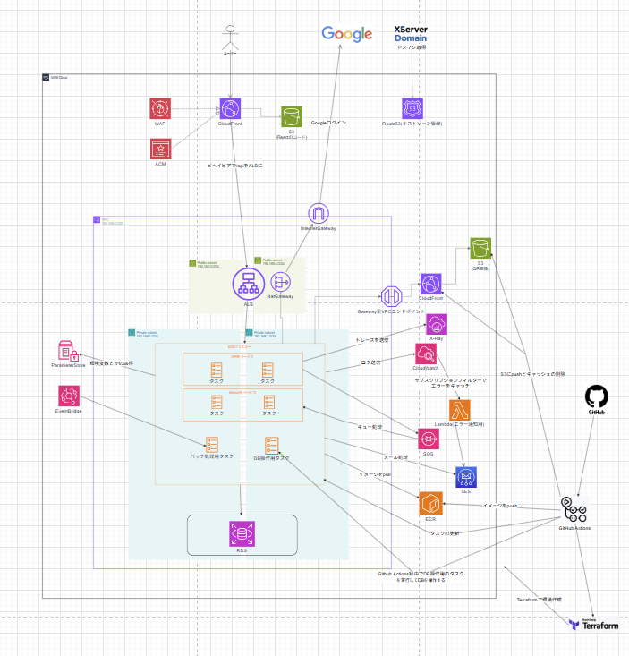

# React + Laravel + AWS (Terraform / ECS) フルスタック練習リポジトリ

React フロントエンド・Laravel バックエンド・Terraform による AWS インフラ・ecspresso による ECS デプロイ・GitHub Actions による CI/CD を **1 つのリポジトリで通しで構築** した自己学習用プロジェクトです。
特に **AWS インフラ設計 (Terraform)** と **CI/CD 自動化** の実装にフォーカスしています。


---

## 目次

- [アーキテクチャ](#アーキテクチャ)
- [技術スタック](#技術スタック)
- [主要機能](#主要機能)
- [ディレクトリ構成](#ディレクトリ構成)
- [ローカル開発](#ローカル開発)
- [AWS デプロイ構成](#aws-デプロイ構成)
- [CI/CD パイプライン](#cicd-パイプライン)
- [関連ドキュメント](#関連ドキュメント)

---

## アーキテクチャ



主な構成要素:

- **配信**: Route53 → CloudFront (WAF 適用) を単一の入口とし、フロントエンド静的アセットは S3 (OAC 経由)、`/api/*` は同一ディストリビューションのビヘイビアで ALB → ECS (API) へ転送。ALB はデフォルト 403 + `X-CloudFront-Secret` ヘッダー一致のみ許可で、CloudFront 経由以外からのアクセスを遮断 (WAF バイパス防止)
- **アプリ実行**: ECS Fargate (Web タスク / Queue Worker タスク / バッチタスク / 単発実行 Runner タスク)
- **データ**: RDS for MariaDB 11.4
- **非同期処理**: SQS (QR コード生成) / EventBridge (日次バッチ) / SES (メール送信)
- **可観測性**: CloudWatch Logs / Alarms, X-Ray (OpenTelemetry トレース) / Lambda 経由のエラー通知
- **CI/CD**: GitHub Actions → ECR push → ecspresso による ECS デプロイ / S3 sync + CloudFront invalidation / Terraform plan/apply

---

## 技術スタック

### フロントエンド ( `frontend/www` )

| カテゴリ | 採用技術 |
| --- | --- |
| フレームワーク | React 19.2 / TypeScript 5.9 |
| ビルド | Vite 7 |
| スタイリング | TailwindCSS 3.4 |
| ルーティング | React Router DOM 6 |
| HTTP | axios |
| 認証 | `@react-oauth/google` (Google OAuth) |
| Lint | ESLint 9 + TypeScript ESLint |

### バックエンド ( `backend/www` )

| カテゴリ | 採用技術 |
| --- | --- |
| フレームワーク | Laravel 12 / PHP 8.2 |
| DB | RDS for MariaDB 11.4 |
| 認証 | Laravel Sanctum (API トークン) + Socialite (Google OAuth) |
| ストレージ | League Flysystem AWS S3 v3 |
| キュー | Laravel Queue (SQS ドライバ) |
| メール | SES / Mailpit (ローカル) |
| QR 生成 | Simple QRCode |
| 可観測性 | OpenTelemetry (OTLP Exporter / Auto-Laravel / SDK) |
| テスト | PHPUnit |

### インフラ / DevOps

| カテゴリ | 採用技術 |
| --- | --- |
| IaC | Terraform (`terraform/stg`, `terraform/modules`) |
| ECS デプロイ | ecspresso (Jsonnet による定義) |
| CI/CD | GitHub Actions (OIDC によるパスワードレス AWS 認証) |
| コンテナ | Docker / Docker Compose / ECR |
| ローカル補助 | Mailpit (SMTP), MinIO (S3 互換) |

---

## 主要機能

- **Google OAuth ログイン** — Socialite + `@react-oauth/google` でフロント/バック両方で認可コードフロー対応
- **QR コード生成 (2 系統)**
  - **同期**: `POST /qrcodes` で即時生成し S3 アップロード
  - **非同期**: `POST /qrcodes/async` で SQS にエンキュー → Queue Worker タスクが処理
- **メール送信** — `POST /mail/send` (本番 SES / ローカル Mailpit)
- **日次レポートバッチ** — EventBridge スケジュール → ECS バッチタスク (`SendDailyReportCommand`) で日次集計メールを送信
- **DB 操作タスク** — `db-task` ワークフローから単発の ECS Runner タスクを起動し、マイグレーション等を実行
- **ヘルスチェック / S3 デバッグ** — `GET /health` ほか

---

## ディレクトリ構成

```
.
├── frontend/www/         # React アプリ (Vite + TS + Tailwind)
├── backend/www/          # Laravel アプリ (PHP 8.2)
├── terraform/
│   ├── stg/              # ステージング環境のエントリーポイント
│   └── modules/          # 再利用モジュール (app-infrastructure 等)
├── ecspresso/
│   ├── _common.libsonnet # 共通定義 (環境変数グループ・ログドライバ等)
│   └── stg/              # web / queue-worker / batch-daily-report / runner
├── docker/
│   ├── ecr/              # 本番用イメージ Dockerfile (backend / nginx / frontend)
│   ├── laravel/          # ローカル用 Laravel コンテナ
│   ├── nginx/            # ローカル用 nginx コンテナ
│   ├── node/             # フロントエンドビルド用
│   └── storybook/        # Storybook 用
├── lambda/               # Lambda 関数 (エラー通知等)
├── docs/                 # 設計・運用ドキュメント
├── drawio/               # アーキテクチャ図 (architecture.png / .drawio)
├── environment/          # 環境設定サンプル
├── .github/workflows/    # GitHub Actions CI/CD
├── docker-compose.yml    # ローカル統合環境
└── Makefile
```

---

## ローカル開発

### 前提

- Docker / Docker Compose
- Node.js 20+
- PHP 8.2+ / Composer (バックエンドを直接動かす場合)

### 起動手順

```bash
# 1. コンテナ群を起動 (nginx + Laravel FPM + scheduler + MySQL + Mailpit)
docker compose up -d

# 2. バックエンド依存解決とマイグレーション
cd backend/www
composer install
php artisan migrate

# 3. フロントエンド起動
cd ../../frontend/www
npm install
npm run dev
```

`backend/www` では `composer dev` を実行すると、開発サーバ・キューリスナー・ログ tail・Vite が並列起動します。
詳細なローカルセットアップは [docs/local-dev/environment_setup.md](docs/local-dev/environment_setup.md) / [docs/local-dev/mailpit_setup.md](docs/local-dev/mailpit_setup.md) / [docs/local-dev/minio_setup.md](docs/local-dev/minio_setup.md) を参照してください。

---

## AWS デプロイ構成

すべて Terraform (`terraform/stg`, `terraform/modules/app-infrastructure`) で IaC 管理しています。

| レイヤ | 管理リソース |
| --- | --- |
| ネットワーク | VPC / Public・Private サブネット / NAT Gateway / ALB / Security Groups |
| コンピュート | ECS Fargate (Web Service, Queue Worker Service, Daily Report Batch Task, Runner Task) |
| データ | RDS for MariaDB 11.4 |
| 配信 (フロント) | CloudFront + S3 (OAC) + ACM + Route53 + WAF |
| 配信 (API) | CloudFront の `/api/*` ビヘイビア → ALB (`X-CloudFront-Secret` で CloudFront 経由のみ許可、デフォルト 403) |
| 認証/ID | IAM (GitHub Actions OIDC ロール, ECS タスクロール, パススルー設計) |
| メッセージング | SQS (QR 非同期キュー) / SES (メール) / SNS (アラート) |
| スケジューラ | EventBridge → ECS RunTask |
| 可観測性 | CloudWatch Logs / Alarms, X-Ray (OpenTelemetry), Lambda エラー通知 |
| 設定管理 | SSM Parameter Store |
| イメージ | ECR |

設計上の主なポイントは以下を参照:

- インフラ全体のコスト試算: [docs/aws-infra/aws-cost-estimation-verified.md](docs/aws-infra/aws-cost-estimation-verified.md)
- ECS の設定変数設計: [docs/aws-infra/ecs-config-variables.md](docs/aws-infra/ecs-config-variables.md)
- ECS タスクの IAM PassRole: [docs/aws-infra/iam_passrole_for_ecs.md](docs/aws-infra/iam_passrole_for_ecs.md)
- モジュール分割のリファクタ: [docs/aws-infra/module-refactoring.md](docs/aws-infra/module-refactoring.md)

---

## CI/CD パイプライン

`.github/workflows/` に以下を配置しています。

| ワークフロー | 役割 |
| --- | --- |
| `ecr-deploy-laravel.yml` / `ecr-deploy-nginx.yml` | Docker イメージをビルドし ECR へ push |
| `ecs-update-laravel.yml` / `ecs-update-nginx.yml` / `ecs-update-laravel-que.yml` | ECS タスク定義の更新 |
| `ecspresso-update-task.yml` | ecspresso による Web / Queue Worker / バッチタスクの統合デプロイ |
| `db-task.yml` | DB 操作用の ECS Runner タスクを手動実行 (マイグレーション等) |
| `s3-deploy-frontend.yml` | フロントエンドを S3 に sync + CloudFront invalidation |
| `terraform-apply-plan.yml` | Terraform の plan / apply |
| `terraform-destroy-stg.yml` | ステージング環境の destroy |

デプロイの流れ:

```
git push
  ├─ (バックエンド) → ECR push → ecspresso deploy → ECS rolling update (CircuitBreaker で自動ロールバック)
  └─ (フロントエンド) → S3 sync → CloudFront invalidation
```

詳細は以下:

- [docs/deploy/ecspresso-deployment-pipeline.md](docs/deploy/ecspresso-deployment-pipeline.md)
- [docs/deploy/ecspresso-jsonnet-refactor.md](docs/deploy/ecspresso-jsonnet-refactor.md)
- [docs/deploy/codedeploy_ecs_deployment.md](docs/deploy/codedeploy_ecs_deployment.md)
- [docs/deploy/db-task-workflow.md](docs/deploy/db-task-workflow.md)
- [docs/deploy/github_actions_secrets.md](docs/deploy/github_actions_secrets.md)

---

## 関連ドキュメント

`docs/` 配下に設計・運用ドキュメントをまとめています。

### 設計意図・工夫点・改善点（まず読む）

- [interview-prep.md](docs/notes/interview-prep.md) — 本プロジェクトの工夫点・改善点を Q&A 形式でまとめたサマリ

### コスト / 全体設計

- [aws-cost-estimation-verified.md](docs/aws-infra/aws-cost-estimation-verified.md) — AWS コスト試算
- [module-refactoring.md](docs/aws-infra/module-refactoring.md) — Terraform モジュール分割のリファクタ

### デプロイ設計

- [codedeploy_ecs_deployment.md](docs/deploy/codedeploy_ecs_deployment.md)
- [ecspresso-deployment-pipeline.md](docs/deploy/ecspresso-deployment-pipeline.md)
- [ecspresso-jsonnet-refactor.md](docs/deploy/ecspresso-jsonnet-refactor.md)

### タスク / ジョブ

- [batch_daily_report.md](docs/app/batch_daily_report.md) — 日次バッチ設計
- [sqs_queue_qrcode.md](docs/app/sqs_queue_qrcode.md) — SQS 非同期 QR 生成
- [db-task-workflow.md](docs/deploy/db-task-workflow.md) — DB 操作タスクの実行フロー

### 設定 / 環境

- [ecs-config-variables.md](docs/aws-infra/ecs-config-variables.md)
- [iam_passrole_for_ecs.md](docs/aws-infra/iam_passrole_for_ecs.md)
- [environment_setup.md](docs/local-dev/environment_setup.md)
- [github_actions_secrets.md](docs/deploy/github_actions_secrets.md)

### ローカル開発

- [mailpit_setup.md](docs/local-dev/mailpit_setup.md)
- [minio_setup.md](docs/local-dev/minio_setup.md)
- [php_ini_review.md](docs/local-dev/php_ini_review.md)
- [php_fpm_config.md](docs/local-dev/php_fpm_config.md)

