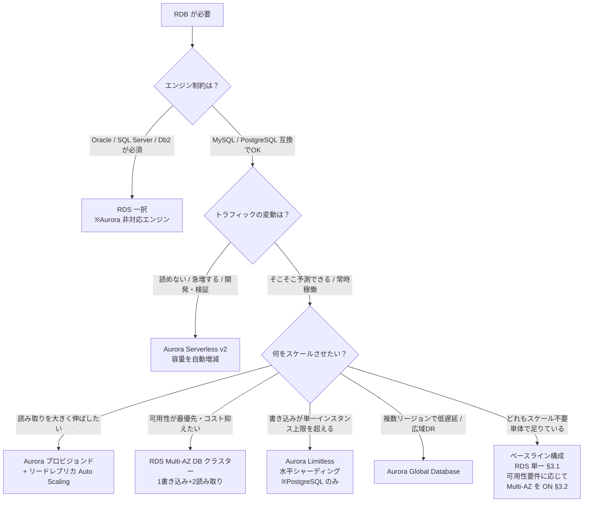
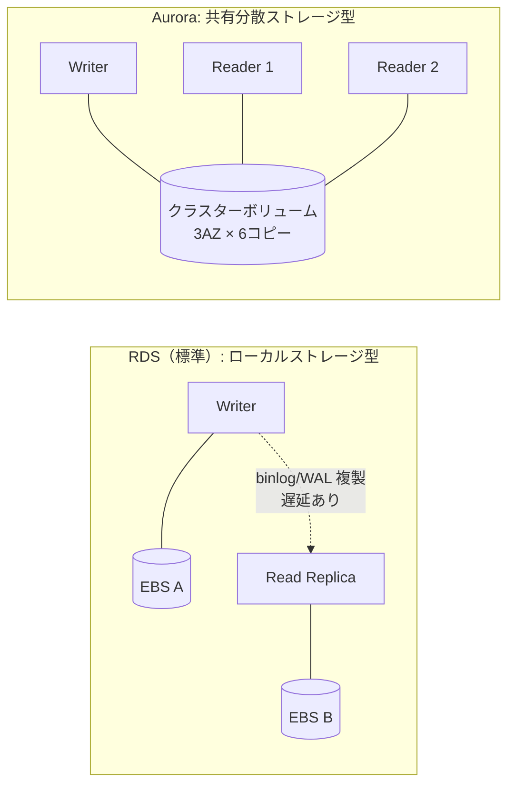

# AWS リレーショナルデータベース 選択肢リファレンス

> **このドキュメントの位置づけ**: 特定プロジェクトに依存しない、AWS のリレーショナルデータベース（RDB）選択肢の汎用技術リファレンスです。「RDS でインスタンスのスペックを選ぶ」「リードレプリカを足す」以外にどんな選択肢があり、どういう要件・基準で選ぶのか（自動スケールするか／読みに強いか書きに強いか両方強いか／他と何が違うか）を、同じ物差し（8 軸）で並べて整理します。
>
> **数値の時点**: 本文中の上限値・課金単位などは **2026-06 時点** の AWS 公式ドキュメントに基づきます。数値は変わりうるため、実設計時は末尾の [参照リンク集](#参照リンク集) から最新を確認してください。

---

## 目次

- [0. 結論：選択フローチャート](#0-結論選択フローチャート)
- [1. 比較の 8 軸](#1-比較の-8-軸)
- [2. アーキテクチャの基礎：RDS と Aurora は「ストレージ」が根本的に違う](#2-アーキテクチャの基礎rds-と-aurora-はストレージが根本的に違う)
- [3. 選択肢カタログ（コア）](#3-選択肢カタログコア)
  - [3.1 RDS（標準）— 単一インスタンス](#31-rds標準-単一インスタンス)
  - [3.2 RDS Multi-AZ（DB インスタンス構成）](#32-rds-multi-azdb-インスタンス構成)
  - [3.3 RDS Multi-AZ DB クラスター](#33-rds-multi-az-db-クラスター)
  - [3.4 RDS リードレプリカ](#34-rds-リードレプリカ)
  - [3.5 Aurora（プロビジョンド）](#35-auroraプロビジョンド)
  - [3.6 Aurora Serverless v2](#36-aurora-serverless-v2)
- [4. 選択肢カタログ（拡張）](#4-選択肢カタログ拡張)
  - [4.1 Aurora レプリカ + Auto Scaling](#41-aurora-レプリカ--auto-scaling)
  - [4.2 Aurora Global Database](#42-aurora-global-database)
  - [4.3 Aurora Limitless Database（水平シャーディング）](#43-aurora-limitless-database水平シャーディング)
  - [4.4 Aurora I/O-Optimized](#44-aurora-io-optimized)
  - [4.5 RDS Proxy（接続プーリング）](#45-rds-proxy接続プーリング)
- [5. 8 軸比較表（全部入り）](#5-8-軸比較表全部入り)
- [6. 「別物」との対比（RDB の外側）](#6-別物との対比rdb-の外側)
- [7. 要件別の選び方チートシート](#7-要件別の選び方チートシート)
- [参照リンク集](#参照リンク集)

---

## 0. 結論：選択フローチャート

細かい話の前に、選定の大筋を先に置きます。

> **「どれもスケール不要」の出口**: D の各分岐は「何かをスケールさせたい」場合の選択肢です。読み取りも書き込みも単一インスタンスで足りているなら、凝った構成に進まず**ベースライン（RDS 単一）に留まるのが正解**です。スケールしないことはコスト最適の結果であって手抜きではありません。将来 D のいずれかの条件が現実になった時に、その分岐へ移行します（§3.5 のとおり Aurora は RDS からの自然なステップアップ先）。
>
> **横串の軸（スケールとは独立）**: Multi-AZ（インスタンス構成・§3.2）はこのフローの分岐には現れません。これは「何をスケールさせるか」ではなく**可用性のオプション**で、上記のどの RDS 構成にも上乗せできる**直交した軸**だからです。読み取り/書き込みのスケールには寄与せず（スタンバイは読めない＝冗長専用）、**可用性要件（RPO/RTO・許容ダウンタイム・SLA）で ON/OFF を判断**します。なお Aurora は構成上もともと 3 AZ 冗長です。
>
> **大原則**: 「書き込みは原則スケールアップ（垂直）、読み取りはスケールアウト（水平＝レプリカ追加）」がマネージド RDB 全般の基本性質です。この非対称性を理解すると、各サービスの違いがすべて説明できます。唯一の例外が、書き込みを水平分割できる **Aurora Limitless** です。
>
> **本プロジェクトへの適用例**: 現在の RDS（MariaDB 単一インスタンス）がこのフローのどこに該当するか、Aurora との実単価コスト比較・損益分岐は [`aws-rds-selection-applied.md`](./aws-rds-selection-applied.md) にまとめています。
>
### このフローは「構成」までを選ぶ ＝ 選定は 2 階層

フローチャートが決めるのは **①構成（アーキテクチャ/トポロジ）** まで。その先に **②容量の選定** が必ず残り、これが 2 系統（インスタンス型 / ACU 型）に分かれます。

| フローの選択先 | ②で何を選ぶか | 種類 |
|---|---|---|
| RDS 単一 / Multi-AZ インスタンス | **インスタンスクラス**（`db.t4g.medium`, `db.r6g.large` など vCPU/メモリの型） | インスタンス型 |
| RDS Multi-AZ DB クラスター | **インスタンスクラス**（NVMe ローカルストレージ系に限定: `db.m5d`, `db.r6gd`, `db.x2iedn` など） | インスタンス型（制限あり） |
| Aurora プロビジョンド | **インスタンスクラス**（`db.r6g.large` など Aurora 用の型） | インスタンス型 |
| Aurora Serverless v2 | **ACU レンジ**（Min〜Max。例 0.5〜16 ACU）。固定クラスは選ばない | ACU 型 |
| Aurora Limitless | **最大 ACU**（ルーター/シャード数が決まる）。固定クラスは選ばない | ACU 型 |
| Aurora Global Database | プライマリ/セカンダリ**各クラスタごとに** ②を選ぶ（プロビジョンド=クラス、Serverless=ACU） | 両方ありうる |

**ポイント**

- **インスタンス型（プロビジョンド系）**: 「②でインスタンスクラスを選ぶ」＝まさに「**負荷に応じたスペックを選ぶ**」こと。これが**垂直スケール（書き込みスケール）の実体**。
- **ACU 型（Serverless v2 / Limitless）**: クラスを固定で選ばず**容量レンジ（ACU）だけ指定**し中身は自動増減。これが「**自動スケールする**」構成の正体。
- **クラス選定はさらに枝分かれ**: インスタンス型を選ぶ場合、ファミリー（汎用 `m` / メモリ最適化 `r` / バースト `t`）× 世代（`6g` など Graviton 等）× サイズ（`large`/`xlarge`…）を、CPU・メモリ・コストで選ぶ。

> **②の具体的な選び方**（各構成のインスタンスクラス / ACU レンジの決め方、ファミリー・世代の特徴）は別ドキュメント [`aws-rds-capacity-sizing.md`](./aws-rds-capacity-sizing.md) にまとめています。

> **ACU（Aurora Capacity Unit）とは**: Aurora Serverless の容量を表す単位で、**CPU・メモリ・ネットワークをひとまとめにした"容量の目盛り"**。**1 ACU ≒ 約 2 GiB メモリ + 相応の vCPU**。固定のインスタンスクラス（例 `db.r6g.large`）を選ぶ代わりに「**0.5 ACU〜16 ACU の範囲で**」のように指定すると、負荷に応じて Aurora がその範囲内で**秒単位に容量を増減**します。課金は「使った ACU × 秒」。Min を **0 ACU** にできるバージョンでは、アイドル時に自動停止してコストをほぼゼロにできます（詳細は §3.6 / §4.3）。

---

## 1. 比較の 8 軸

各サービスを以下の同一軸で評価します。

| # | 軸 | 何を見るか |
|---|----|-----------|
| 1 | **エンジン互換性** | MySQL / PostgreSQL / MariaDB / Oracle / SQL Server / Db2 のどれが使えるか |
| 2 | **書き込みスケール** | 垂直（インスタンス強化）のみか、水平分割できるか |
| 3 | **読み取りスケール** | レプリカの最大数・レプリケーション遅延・読み取りエンドポイントの有無 |
| 4 | **自動スケール** | 手動 / メトリクス連動オートスケール / Serverless（容量自体が自動増減） |
| 5 | **可用性・冗長** | Multi-AZ の有無、フェイルオーバー時間、マルチリージョン |
| 6 | **ストレージ・アーキ** | インスタンスローカル型か、共有分散ストレージ型か |
| 7 | **コストモデル** | インスタンス時間課金 / ACU 課金 / I/O 課金の有無 |
| 8 | **代表ユースケース** | どんな要件のときに第一候補になるか |

---

## 2. アーキテクチャの基礎：RDS と Aurora は「ストレージ」が根本的に違う

選択肢の違いの 8 割は、この「ストレージ層の設計差」から派生します。先にここを押さえます。

### RDS（標準）：インスタンスにストレージが紐づく

各 DB インスタンスは自分専用の EBS ボリュームを持ちます。レプリカや Multi-AZ スタンバイは **別ボリュームを持ち、エンジンのレプリケーション（binlog/WAL）でデータをコピー**します。コピーである以上、遅延が発生し、レプリカ追加コストはストレージ分まるごと増えます。

### Aurora：インスタンスとストレージが分離した共有分散ストレージ

Aurora は「クラスターボリューム」という分散 SSD ストレージを持ち、**データを 3 つの AZ に 6 重コピー**して保持します。各 DB インスタンス（ライター/リーダー）は**同じストレージ層を共有**します。リーダーを足してもデータのコピーは発生せず（同じボリュームを見る）、追加・削除が速く、レプリケーション遅延も小さい（通常 100ms 未満）。

| | RDS（ローカル型） | Aurora（共有型） |
|---|---|---|
| ストレージ | インスタンスごとに専有 | 全インスタンスで共有 |
| レプリカ追加 | データを丸ごと複製 → 遅い・高い | ボリューム共有 → 速い・安い |
| レプリケーション遅延 | 秒オーダーになりうる | 通常 100ms 未満 |
| ストレージ容量 | 事前確保（拡張は可） | 使った分だけ自動拡張 |
| フェイルオーバー | スタンバイへ昇格 | リーダーを即昇格（データ移動不要） |

> **覚え方**: RDB のスケールの効きやすさ・可用性・コストの差は、ほぼこの 1 枚の図に還元できます。「Aurora はストレージを共有しているから、読み取りスケールとフェイルオーバーが速くて安い」。

---

## 3. 選択肢カタログ（コア）

### 3.1 RDS（標準）— 単一インスタンス

最も基本。マネージドな単一 DB インスタンス。

- **エンジン互換性**: MySQL / PostgreSQL / MariaDB / Oracle / SQL Server / Db2（フルラインナップ）
- **書き込みスケール**: 垂直のみ（インスタンスクラスを上げる）
- **読み取りスケール**: 単体では不可（レプリカを足して対応 → 3.4）
- **自動スケール**: なし（ストレージの自動拡張＝ストレージオートスケーリングはあるが、CPU/メモリは手動変更）
- **可用性**: 単一 AZ。インスタンス障害＝ダウン（自動復旧はあるが時間がかかる）
- **ストレージ・アーキ**: ローカル（EBS）
- **コストモデル**: インスタンス時間 + ストレージ + I/O（gp3 等）
- **ユースケース**: 開発・検証環境、可用性要件の低い社内ツール、コスト最優先の小規模本番

### 3.2 RDS Multi-AZ（DB インスタンス構成）

同期レプリケーションするスタンバイを別 AZ に持つ、定番の高可用性構成。

- **書き込み/読み取りスケール**: いずれも単体と同じ（**スタンバイは読み取りに使えない**＝あくまで待機系）
- **自動スケール**: なし
- **可用性**: ◎。AZ 障害時に **1〜2 分程度で自動フェイルオーバー**。同期レプリケーションなのでデータ損失なし（RPO ≒ 0）
- **コストモデル**: インスタンス代が実質 2 倍（スタンバイ分）
- **ユースケース**: 「可用性は欲しいが読み取りスループットの上乗せは不要」な一般的な本番
- **注意**: スタンバイは**冗長専用**。読み取りを分散したいなら 3.3 か 3.4 へ。

### 3.3 RDS Multi-AZ DB クラスター

「Multi-AZ（インスタンス構成）」とは別物。**1 ライター + 2 リーダーを 3 AZ に配置**する構成。

- **読み取りスケール**: ○。**2 つのリーダーが読み取りトラフィックを処理できる**（待機専用ではない）
- **書き込みスケール**: 垂直のみ。ただし**準同期レプリケーション**（少なくとも 1 リーダーの ACK で commit）のため、従来の Multi-AZ インスタンス構成より**書き込みレイテンシが低い**ことが多い
- **自動スケール**: なし（リーダー数は 2 で固定）
- **可用性**: ◎。リーダーが**フェイルオーバー先を兼ねる**。通常 35 秒程度で切替
- **制約**: 対応インスタンスクラスが限定（`db.m5d`, `db.r6gd`, `db.x2iedn` など NVMe ローカルストレージ系）、対応エンジン/リージョンに制限あり
- **ユースケース**: Aurora を使わず（あるいは使えないエンジンで）「高可用性 + 適度な読み取り余力 + 低書き込み遅延」を両立したいとき

> **Multi-AZ インスタンス vs Multi-AZ DB クラスターの一言整理**: 前者はスタンバイ 1 台で**読めない**（冗長専用）。後者はリーダー 2 台で**読める**（冗長 + 読み取り分散）。

### 3.4 RDS リードレプリカ

ソース DB から非同期レプリケーションする読み取り専用インスタンス。読み取りスケールアウトの基本手段。

- **読み取りスケール**: ◎。**ソース 1 台あたり最大 15 台**（MySQL / MariaDB / PostgreSQL。Oracle / SQL Server / Db2 はより少なく上限はエンジン依存）。カスケード（レプリカのレプリカ）も可
- **書き込みスケール**: ×（むしろレプリケーション負荷が乗る）
- **レプリケーション遅延**: **非同期**のため遅延あり（負荷次第で数秒以上もありうる）。「**読み取り整合性が緩くてよい読み取り**」専用と考える
- **自動スケール**: ×（手動で台数を増減。Aurora のような台数オートスケーリングは標準では無い）
- **可用性（おまけ）**: 別リージョンにレプリカを置けば簡易 DR や、昇格による移行にも使える
- **コストモデル**: レプリカは独立インスタンス＝**台数分まるごと課金**（ストレージも別）
- **ユースケース**: 参照系が重いアプリ（レポート、検索、分析クエリの一部）。書き込みと読み取りを物理的に分離したいとき
- **注意**: アプリ側で「書き込みはソース、読み取りはレプリカ」と**接続を振り分ける実装**が必要。遅延に耐えられない読み取り（書いた直後に必ず読む等）はソースへ。

#### Multi-AZ DB クラスター（3.3）vs リードレプリカ（3.4）

どちらも「追加で読めるインスタンス」を持つため混同しやすいが、**主目的が逆**。クラスターは「可用性が主目的でリーダーがついでに読める」、リードレプリカは「読み取りスケールが主目的で可用性は副次的」。

| 観点 | Multi-AZ DB クラスター | リードレプリカ |
|---|---|---|
| **主目的** | 高可用性（HA）＋副次的に読み取り余力 | 読み取りスケールアウト |
| **構成** | 1 ライター + **2 リーダー固定**（3 AZ） | ソース + **任意の台数**（最大 15、いつでも増減） |
| **レプリケーション** | **準同期**（最低 1 リーダーの ACK で commit） | **非同期**（ACK 待たない） |
| **データ損失リスク** | 小（準同期で障害時もほぼ欠落なし） | あり（非同期。ソース障害で未反映分が消えうる） |
| **自動フェイルオーバー** | **あり**。リーダーが昇格先を兼ねる（約35秒） | **なし**（手動昇格は可能だが HA 用ではない） |
| **クロスリージョン** | 不可（単一リージョン 3 AZ 固定） | **可能**（別リージョンに置ける → DR / 移行に流用） |
| **エンドポイント** | クラスター / リーダーエンドポイントが自動振り分け | レプリカごとに個別。**アプリ側で振り分け実装が必要** |
| **書き込みへの影響** | 書込レイテンシはむしろ低めなことが多い | ソースに複製負荷が乗る |
| **コスト** | 3 インスタンス分（固定） | レプリカ台数分（増やすほど増える） |

**一番効く違い**: ①目的が逆（HA ファースト vs 読みスケールファースト）、②クラスターは準同期＋自動 FO でデータ損失が小さいがレプリカは非同期で遅延・損失リスクあり、③クラスターはリーダー 2 台固定だがレプリカは最大 15 まで自由増減。

**使い分け**: 可用性が主目的なら Multi-AZ DB クラスター／読み取りを大きく・柔軟に伸ばすならリードレプリカ／両方を高いレベルで欲しいなら一段上の **Aurora**（§3.5）。なお両者は併用も可能（HA はクラスター、読みスケールはレプリカ）。

### 3.5 Aurora（プロビジョンド）

MySQL / PostgreSQL 互換のクラウドネイティブ RDB。共有分散ストレージ（§2）が最大の特徴。

- **エンジン互換性**: **MySQL 互換 / PostgreSQL 互換のみ**（Oracle 等は不可）
- **書き込みスケール**: 垂直（ライターは 1 台）。※水平分割は Limitless（4.3）でのみ可能
- **読み取りスケール**: ◎◎。**最大 15 のリーダー（Aurora レプリカ）**がストレージを共有。遅延は通常 100ms 未満。リーダーエンドポイントが自動で負荷分散
- **自動スケール**: リーダーは Auto Scaling 可（4.1）。インスタンスサイズ自体の自動増減は Serverless v2（3.6）
- **可用性**: ◎◎。ライター障害時、リーダーを**約 30 秒以内で昇格**（データ移動不要）。ストレージは 3 AZ 6 重コピー
- **ストレージ・アーキ**: 共有分散クラスターボリューム。使った分だけ自動拡張
- **コストモデル**: インスタンス時間 + ストレージ + I/O（Standard は I/O 課金あり／I/O-Optimized は I/O 定額・4.4）
- **ユースケース**: 中〜大規模本番、読み取り集約型、可用性とスケールの両方が欲しいとき。RDS からの自然なステップアップ先

### 3.6 Aurora Serverless v2

Aurora の容量（CPU/メモリ）を **ACU（Aurora Capacity Unit）単位で自動増減**する構成。1 ACU ≒ 2 GiB メモリ相当。

- **自動スケール**: ◎◎（これが主役）。負荷に応じて**秒単位で容量がシームレスに増減**。設定は `MinCapacity`〜`MaxCapacity`
  - `MinCapacity`: **0 ACU**（オートポーズ対応バージョン）または **0.5 ACU**。0 にすると一定アイドル後（`SecondsUntilAutoPause` = 300〜86,400 秒）に**自動停止**しコストをゼロ近くに
  - `MaxCapacity`: **最大 256 ACU**（半段＝0.5 刻み）
- **書き込み/読み取りスケール**: Aurora と同じ（ライター 1 + リーダー最大 15）。各インスタンスを Serverless 化できる
- **可用性**: Aurora と同等（共有ストレージ）
- **コストモデル**: **ACU × 秒**で課金。使った容量だけ払う
- **ユースケース**: トラフィックが読めない／スパイクする／開発・検証・たまにしか使わない環境。「ピークに合わせて固定プロビジョンすると無駄、でもスケールはしたい」ケースの本命
- **注意**: 常時高負荷で張り付くワークロードでは、固定プロビジョンドの方が安いことがある（ACU 単価はやや割高）

---

## 4. 選択肢カタログ（拡張）

### 4.1 Aurora レプリカ + Auto Scaling

Aurora のリーダー（最大 15）に対し、**CPU 使用率や接続数に応じてリーダー台数を自動増減**する仕組み。

- **自動スケール**: ○（**読み取り台数**のオートスケール）。RDS リードレプリカには無い、Aurora ならではの機能
- **効果**: 読み取りトラフィックの変動に台数で追従。リーダーエンドポイントが新規リーダーへ自動で振り分け
- **注意**: スケールさせるのは**読み取りのみ**。書き込み（ライター）はスケールしない

### 4.2 Aurora Global Database

1 つの Aurora DB を**複数リージョン**に展開。

- **構成**: **プライマリ 1 リージョン（書き込み）+ 最大 10 セカンダリリージョン（読み取り専用）**
- **レプリケーション**: ストレージ層での専用インフラ複製。**遅延は通常 1 秒未満**（エンジンを介さないブロックレベル複製）
- **読み取りスケール**: 各セカンダリで独立にリーダーを足せる → 地理的に近い読み取りを低遅延化
- **書き込み**: プライマリのみ。ただし**ライトフォワーディング**でセカンダリ経由の書き込みをプライマリへ転送可能
- **可用性 / DR**: リージョン障害時に**1 分未満**でセカンダリを昇格（計画的スイッチオーバー / DR フェイルオーバー）。RPO は通常 1 秒程度
- **ユースケース**: グローバル展開アプリの低遅延読み取り、リージョン単位の広域災害対策（DR）

### 4.3 Aurora Limitless Database（水平シャーディング）

**書き込みを水平スケールできる**唯一の選択肢（本リファレンスの範囲内で）。

- **エンジン互換性**: **Aurora PostgreSQL のみ**
- **書き込みスケール**: ◎◎（**水平シャーディング**）。データを複数シャードに自動分散し、書き込みスループットを単一インスタンスの上限を超えて伸ばす
- **構成**: 「ルーター（クエリを振り分け）」+「シャード（データを保持）」。作成時の最大 ACU で初期数が決まる（例: **16〜400 ACU で 2 ルーター/2 シャード**、**2301〜6144 ACU で 8 ルーター/16 シャード**）。シャード分割やルーター追加は SQL で可能
- **自動スケール**: 各ノードが ACU 範囲内で自動スケール
- **ユースケース**: 単一ライターの書き込み上限が本当にボトルネックになる超大規模 OLTP。**まずはここに来る前に Aurora の垂直強化やアプリ側分割で足りないかを必ず検討する**（運用が複雑なため最後の手段）

### 4.4 Aurora I/O-Optimized

Aurora の**ストレージ課金モデル**の選択肢（サービスというより設定）。

- **Aurora Standard**: ストレージ + **リクエストごとの I/O 課金あり**。I/O が少〜中程度なら割安
- **Aurora I/O-Optimized**: **I/O リクエスト課金なし**（定額）。コンピュート/ストレージ単価はやや高い
- **選択基準**: **I/O コストが DB 総コストの 25% を超える**なら I/O-Optimized が有利、というのが AWS の目安
- **ユースケース**: I/O ヘビーで請求のブレが大きいワークロードのコスト平準化・削減

### 4.5 RDS Proxy（接続プーリング）

DB の前段に置くフルマネージドな**接続プール**。スケールの種類というより「接続の効率化・可用性向上」の補助。

- **役割**: アプリからの大量コネクションをプールして集約し、DB のコネクション枯渇を防ぐ
- **効果**: フェイルオーバー時の切替時間短縮、Lambda など**接続が大量・短命なワークロード**との相性が良い。Secrets Manager + IAM 認証も統合
- **対応**: RDS / Aurora（MySQL / PostgreSQL 系）。Multi-AZ DB クラスターとも併用可
- **ユースケース**: サーバーレス（Lambda）から RDB を叩く、接続数スパイクで `too many connections` が出る、フェイルオーバーの体感ダウンタイムを縮めたい

---

## 5. 8 軸比較表（全部入り）

| サービス / 構成 | エンジン互換 | 書き込みスケール | 読み取りスケール | 自動スケール | 可用性・冗長 | ストレージ | コストモデル |
|---|---|---|---|---|---|---|---|
| **RDS 単一** | 全エンジン | 垂直のみ | なし（単体） | ストレージ容量のみ | 単一 AZ | ローカル | インスタンス時間+ストレージ+I/O |
| **RDS Multi-AZ インスタンス** | 全エンジン | 垂直のみ | なし（スタンバイは読めない） | なし | ◎ 1〜2分でFO・RPO≒0 | ローカル×2 | 実質2倍 |
| **RDS Multi-AZ DB クラスター** | MySQL/PostgreSQL | 垂直（書込遅延は低め） | ○ リーダー2台で読める | なし | ◎ 約35秒でFO | ローカル×3 | 3インスタンス分 |
| **RDS リードレプリカ** | 全エンジン | × | ◎ 最大15台（非同期遅延あり） | × 手動増減 | DR/移行に流用可 | レプリカ毎に別 | レプリカ台数分 |
| **Aurora プロビジョンド** | MySQL/PostgreSQL 互換 | 垂直 | ◎◎ 最大15・遅延<100ms | リーダー台数Auto Scaling | ◎◎ 約30秒でFO・3AZ6重 | 共有分散 | インスタンス+ストレージ+I/O |
| **Aurora Serverless v2** | MySQL/PostgreSQL 互換 | 垂直 | ◎◎（同上） | ◎◎ 容量を秒単位で増減（0/0.5〜256 ACU） | ◎◎（同上） | 共有分散 | ACU×秒 |
| **Aurora + リーダーAutoScaling** | MySQL/PostgreSQL 互換 | 垂直 | ◎◎ 負荷で台数自動増減 | ◎（読み取り台数） | ◎◎ | 共有分散 | インスタンス+I/O |
| **Aurora Global Database** | MySQL/PostgreSQL 互換 | プライマリのみ（書込転送可） | ◎◎ マルチリージョン読み取り | セカンダリで個別 | ◎◎ リージョンDR・1分未満FO | 共有分散×リージョン | リージョン毎 |
| **Aurora Limitless** | **PostgreSQL のみ** | ◎◎ **水平シャーディング** | ◎◎ | ◎ ノード自動スケール | ◎◎ | 共有分散+シャード | ACUベース |

> FO = フェイルオーバー。可用性のフェイルオーバー時間は代表値であり、負荷・データ量・設定で変動します。

---

## 6. 「別物」との対比（RDB の外側）

「リレーショナルか？」「いつ RDB を選ばないか？」を見失わないための対比。**いずれも上の選択肢とは別カテゴリ**です。

| サービス | 種別 | RDB と何が違うか | いつ選ぶ |
|---|---|---|---|
| **EC2 に自前構築** | セルフマネージド RDB | OS/パッチ/バックアップ/HA を**全部自分で運用**。フルコントロールできるが運用負荷が重い | RDS/Aurora 非対応の特殊バージョン・拡張が必須、完全な制御が要るとき。それ以外は基本マネージドを選ぶ |
| **Amazon Redshift** | データウェアハウス（OLAP） | 列指向で**分析クエリ（集計・スキャン）に特化**。トランザクション（OLTP）には不向き | BI・大規模集計・分析基盤。「読み取りが強い RDB」ではなく**用途が別** |
| **Amazon DynamoDB** | NoSQL（キーバリュー/ドキュメント） | スキーマレス・**結合や複雑なクエリが苦手**な代わりに、ほぼ無限の水平スケールと一桁ミリ秒応答 | 超高スループット・キー単位アクセス中心・スキーマ可変。**JOIN や強い整合性のトランザクションが要るなら RDB** |

> よくある誤解：「読み取りを極限までスケールさせたい → DynamoDB / Redshift」と短絡しないこと。RDB の読み取りスケール（Aurora レプリカ等）で足りるケースは多く、リレーショナルモデル（JOIN・トランザクション・既存 SQL 資産）を捨てるコストは大きい。

---

## 7. 要件別の選び方チートシート

| 要件・状況 | 第一候補 | 理由 |
|---|---|---|
| Oracle / SQL Server / Db2 が必須 | **RDS（該当エンジン）** | Aurora は MySQL/PostgreSQL 互換のみ |
| とにかく安く・開発検証 | **RDS 単一** または **Aurora Serverless v2（Min 0）** | アイドル時にコストを最小化 |
| 一般的な本番・可用性が欲しい | **RDS Multi-AZ インスタンス** | 定番。RPO≒0 の自動フェイルオーバー |
| 可用性 + 読み取り余力 + 低書込遅延（Aurora 使わず） | **RDS Multi-AZ DB クラスター** | リーダー2台が読み取り兼フェイルオーバー先 |
| 参照系が重い・読み書き分離したい | **RDS リードレプリカ** or **Aurora + レプリカ** | 読み取りをスケールアウト。Aurora なら遅延小・台数Auto Scaling |
| トラフィックが読めない/スパイクする | **Aurora Serverless v2** | 容量が秒単位で自動増減、ピーク固定の無駄を排除 |
| 中〜大規模本番・スケールと可用性を両立 | **Aurora プロビジョンド** | 共有ストレージで読みスケール・高速FOが安価 |
| グローバル低遅延 / リージョンDR | **Aurora Global Database** | 最大10セカンダリ・遅延<1秒・1分未満FO |
| 書き込みが単一ライターの上限を超える | **Aurora Limitless**（PostgreSQL） | 唯一の書き込み水平スケール。ただし最後の手段 |
| Lambda 等から大量接続・接続枯渇 | **+ RDS Proxy** | 接続プールで枯渇回避・FO短縮 |
| I/O 課金が総コストの25%超 | **+ Aurora I/O-Optimized** | I/O 定額化でコスト平準化 |

---

## 参照リンク集

> 数値・上限は変わりうるため、設計時は必ず最新の公式ドキュメントを確認してください（本文の数値は 2026-06 時点）。

- RDS Multi-AZ DB クラスター（1ライター+2リーダー/3AZ・準同期）: <https://docs.aws.amazon.com/AmazonRDS/latest/UserGuide/multi-az-db-clusters-concepts.html>
- RDS リードレプリカ（MariaDB の例・最大15）: <https://docs.aws.amazon.com/AmazonRDS/latest/UserGuide/USER_MariaDB.Replication.ReadReplicas.html>
- Aurora レプリカ追加（最大15・ストレージ共有）: <https://docs.aws.amazon.com/AmazonRDS/latest/AuroraUserGuide/aurora-replicas-adding.html>
- Aurora ストレージ（共有分散・I/O-Optimized / Standard）: <https://docs.aws.amazon.com/AmazonRDS/latest/AuroraUserGuide/Aurora.Overview.StorageReliability.html>
- Aurora Serverless v2 スケーリング設定（0/0.5〜256 ACU・オートポーズ）: <https://docs.aws.amazon.com/AmazonRDS/latest/APIReference/API_ServerlessV2ScalingConfiguration.html>
- Aurora Global Database（最大10セカンダリ・遅延<1秒）: <https://docs.aws.amazon.com/AmazonRDS/latest/AuroraUserGuide/aurora-global-database.html>
- Aurora レプリケーション方式の比較（Aurora レプリカ遅延<100ms 等）: <https://docs.aws.amazon.com/prescriptive-guidance/latest/aurora-replication-options/compare-solutions.html>
- Aurora PostgreSQL Limitless Database（ルーター/シャード構成）: <https://docs.aws.amazon.com/AmazonRDS/latest/AuroraUserGuide/limitless-cluster.html>
- Amazon Aurora 概要（ユーザーガイド）: <https://docs.aws.amazon.com/AmazonRDS/latest/AuroraUserGuide/CHAP_AuroraOverview.html>
