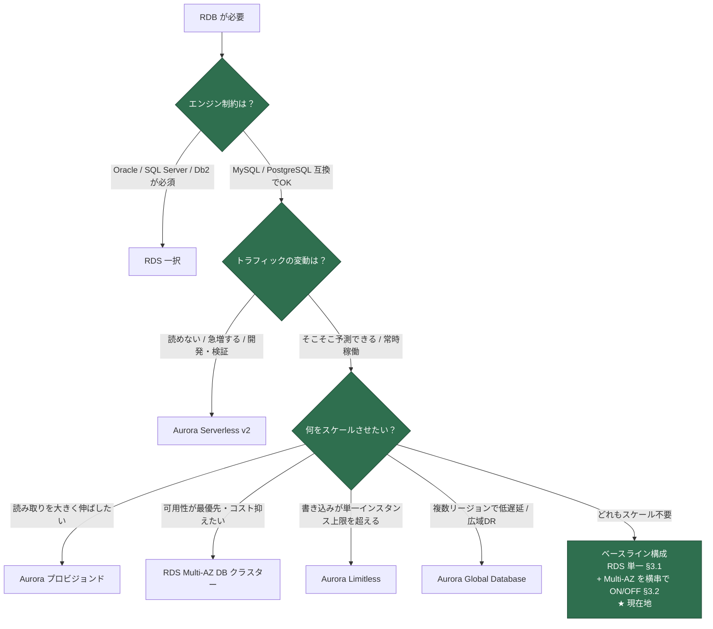

# RDS 選定の本プロジェクトへの適用 — フローチャート上の現在地と Aurora コスト比較

> **このドキュメントの位置づけ**: 汎用リファレンス [`aws-rds-options-reference.md`](./aws-rds-options-reference.md) の選定フローチャートを**このプロジェクトの実構成に適用した**解説です。①現在の RDS がフローのどこに該当するか、② MySQL/PostgreSQL 互換ならどういう時に Aurora を選ぶべきか、③実単価でどちらが安いか（損益分岐）に答えます。RDS シリーズ 3 部作の適用編です（①選択肢 = options-reference、②容量 = [`aws-rds-capacity-sizing.md`](./aws-rds-capacity-sizing.md)、③適用 = 本書）。
>
> **数値の時点**: 単価は **2026-07-07 取得**（AWS 料金 API の 2026-07-03 公開データ、東京リージョン・オンデマンド・USD）。一次情報は末尾の[参照リンク集](#参照リンク集)。

---

## 目次

- [1. 現在の構成（事実の確認）](#1-現在の構成事実の確認)
- [2. フローチャート上の現在地](#2-フローチャート上の現在地)
- [3. MariaDB という選択の 2 つの読み方](#3-mariadb-という選択の-2-つの読み方)
- [4. コスト比較：RDS vs Aurora（東京・実単価）](#4-コスト比較rds-vs-aurora東京実単価)
  - [4.1 段階①：現状同等の最小構成](#41-段階現状同等の最小構成)
  - [4.2 段階②：一般的な本番 HA 構成](#42-段階一般的な本番-ha-構成)
  - [4.3 段階③：読み取りレプリカ N 台の損益分岐](#43-段階読み取りレプリカ-n-台の損益分岐)
- [5. なぜ Aurora Serverless v2（Min 0）ではないのか](#5-なぜ-aurora-serverless-v2min-0ではないのか)
- [6. 結論：Aurora を選ぶと得になる条件](#6-結論aurora-を選ぶと得になる条件)
- [参照リンク集](#参照リンク集)

---

## 1. 現在の構成（事実の確認）

[`terraform/modules/app-infrastructure/rds.tf`](../../terraform/modules/app-infrastructure/rds.tf) の実体は次のとおり。

| 項目 | 値 | 備考 |
|---|---|---|
| エンジン | **MariaDB 11.4** | `engine = "mariadb"`。Aurora に MariaDB 版は存在しない（§3） |
| インスタンス | **db.t4g.micro**（stg） | `rds_config.instance_class` で環境別に指定 |
| ストレージ | **20 GB gp3** | 事前確保型（RDS 標準の EBS） |
| Multi-AZ | **変数で ON/OFF**（stg は OFF） | `rds_config.multi_az`。可用性の横串オプション |
| 利用者 | **stg 本体 ＋ 全 preview 環境** | 検証環境（preview）は自前の RDS を持たず、この共有 RDS 上に PR ごとの database（`preview_pr<n>`）を作る（[terraform/CONTEXT.md](../../terraform/CONTEXT.md) の「preview ユーザー」） |
| 常時接続 | **あり** | ECS の queue worker が常駐、scheduler が定期実行、CloudWatch 監視が常時稼働 |

つまり「**1 台の単一インスタンス RDS が、常設 stg と使い捨て preview 群をまとめて支える常時稼働 DB**」というのが現在地です。

---

## 2. フローチャート上の現在地

[`aws-rds-options-reference.md` §0](./aws-rds-options-reference.md#0-結論選択フローチャート) のフローチャートを現構成で辿ると次のようになります。

**辿り方の解説**（各分岐でなぜその枝を選ぶか）:

1. **B: エンジン制約** → Laravel は MySQL プロトコル互換なら動くため「MySQL/PostgreSQL 互換で OK」側（ただし §3 の注意あり）。
2. **C: トラフィックの変動** → stg は常設・研修用途で負荷は予測可能、かつ共有 RDS として**常時稼働**。「そこそこ予測できる / 常時稼働」側。
3. **D: 何をスケールさせたい？** → **どれも該当しない**。読み取りも書き込みも db.t4g.micro で足りており、マルチリージョン要件もない。

ここが重要なポイントで、**元のフローチャートの D には「どれも不要」の出口が描かれていません**。フローチャートは「何かをスケールさせたい」場合の分岐図であり、スケール要件がないなら **D に入る手前のベースライン構成（RDS 単一インスタンス）** に戻るのが正しい読み方です。上の図ではそれを「★ 現在地」として明示しました。

Multi-AZ（インスタンス構成）が分岐に現れないのも同じ理屈です。これは「何をスケールさせるか」ではなく**可用性の直交軸**なので、ベースラインに対して `rds_config.multi_az` で ON/OFF します（リファレンス §0 の注記どおり）。チートシート（リファレンス §7）で言えば、現構成は「とにかく安く・開発検証 → **RDS 単一**」の行に該当します。

---

## 3. MariaDB という選択の 2 つの読み方

フローチャート B の分岐は「Oracle / SQL Server / Db2 が必須 → RDS 一択」としか書いていませんが、**Aurora は MySQL 互換と PostgreSQL 互換のみで、MariaDB 版は存在しません**。したがって現構成には 2 つの読み方があります。

| 読み方 | 内容 | 本プロジェクトでの妥当性 |
|---|---|---|
| **A: 互換 OK 側**（アプリ基準） | Laravel は `DB_CONNECTION=mysql` で MariaDB にも Aurora MySQL にも接続できる。エンジンは交換可能な実装詳細であり、フロー上は「MySQL/PostgreSQL 互換で OK」側。Aurora は選択肢に**残っている** | フローを辿る上ではこちらが正 |
| **B: RDS 一択側**（運用基準） | パラメータグループが **MariaDB 11.4 固有の新名称**（`log_slow_query` / `log_slow_query_time`、[rds.tf](../../terraform/modules/app-infrastructure/rds.tf) のコメント参照）に依存し始めており、Aurora へ移るには MariaDB → Aurora MySQL の**エンジン移行**（動作検証・パラメータ再設計・移行手順）が必要 | 「明日 Aurora に切り替える」は構成変更ではなく移行プロジェクトになる、という現実の重み |

**結論**: フローチャート上は読み方 A で「互換 OK」側を通るが、MariaDB 固有機能に依存するほど読み方 B（実質 RDS 一択）に近づく。フローチャートが MariaDB を「RDS 一択」枝に挙げていないのは、MariaDB → MySQL は方言差が小さく移行可能なことが多いためで、移行コストがゼロという意味ではない。

---

## 4. コスト比較：RDS vs Aurora（東京・実単価）

### 前提となる単価表（2026-07-07 取得・東京・オンデマンド）

| 項目 | RDS for MariaDB | Aurora MySQL 互換 |
|---|---|---|
| 最小インスタンス | db.t4g.micro **$0.025/h**（月 $18.25） | db.t4g.medium **$0.113/h**（月 $82.49）※ micro / small は**選べない** |
| db.t4g.medium | **$0.101/h**（Multi-AZ $0.202/h） | **$0.113/h**（Standard。I/O-Optimized $0.147/h） |
| db.r6g.large | **$0.255/h**（Multi-AZ $0.510/h） | **$0.313/h**（Standard。I/O-Optimized $0.407/h） |
| Serverless | なし | Serverless v2 **$0.15/ACU-h**（Standard。I/O-Optimized $0.20/ACU-h） |
| ストレージ | gp3 **$0.138/GB-月**（Multi-AZ は 2 倍の $0.276） | **$0.12/GB-月**（Standard。使用量課金・事前確保不要。I/O-Optimized $0.27） |
| I/O | gp3 のベースライン内は追加課金なし | Standard は **$0.24/100万リクエスト**（I/O-Optimized は I/O 課金なし） |
| CPU クレジット（T4g 超過時） | $0.075/vCPU-h | $0.09/vCPU-h |

> 月額は 730 時間で計算。**同一インスタンスクラスの単価は Aurora が 12〜23% 高く、さらに最小クラスが t4g.medium 止まり**（RDS の micro の約 4.5 倍）である点が、小規模構成での決定的な差になる。
>
> なお [`aws-cost-estimation-verified.md`](./aws-cost-estimation-verified.md) の RDS 節も 2026-07-07 に同じ単価（db.t4g.micro $0.025/h・RDS 小計 $21.01/月）へ更新済みで、本書と整合している。

### 4.1 段階①：現状同等の最小構成

「stg ＋ preview 共有の常時稼働 DB」を各選択肢で組んだ場合の月額。

| 構成 | 計算 | 月額 | 現行比 |
|---|---|---|---|
| **現行: RDS db.t4g.micro Single-AZ** | $0.025×730 + 20GB×$0.138 | **$21.01** | 1.0x |
| Aurora プロビジョンド最小（t4g.medium） | $0.113×730 + 20GB×$0.12 + I/O 少量（~$1） | **≈ $86** | **4.1x** |
| Aurora Serverless v2（0.5 ACU 常時張り付き） | 0.5×$0.15×730 + 20GB×$0.12 + I/O | **≈ $58** | 2.8x |
| Aurora Serverless v2（Min 0、1 日 8 時間だけ 0.5 ACU 稼働と仮定） | 0.5×$0.15×243h + ストレージ | **≈ $21** | ≈1.0x |

**読み方**: 常時稼働なら Aurora はどう組んでも **3〜4 倍**。唯一並ぶのは「Min 0 でオートポーズが効く」ケースだが、本プロジェクトではそれが成立しない（§5）。**この規模では RDS 単一が明確に安く、現在の選択はコスト面で正しい。**

### 4.2 段階②：一般的な本番 HA 構成

「自動フェイルオーバーが欲しい」段階（db.t4g.medium 級・20 GB）で比較すると、景色が変わり始めます。

| 構成 | 計算 | 月額 | 得られるもの |
|---|---|---|---|
| RDS Multi-AZ インスタンス（t4g.medium） | $0.202×730 + 20GB×$0.276 | **≈ $153** | FO 1〜2 分。**スタンバイは読めない** |
| Aurora ライター＋リーダー各 1（t4g.medium） | $0.113×2×730 + 20GB×$0.12 + I/O | **≈ $168** | FO 約 30 秒。**リーダーで読み取り分散もできる** |
| RDS Multi-AZ ＋ リードレプリカ 1 台（読みも欲しい場合） | $0.202×730 + $0.101×730 + ストレージ×2 系統 | **≈ $229** | FO 1〜2 分 ＋ 非同期レプリカ（遅延あり） |

**読み方**: 「可用性だけ」なら RDS Multi-AZ が約 $15/月 安い。しかし「**可用性＋読み取り分散の両方**」が要件になった瞬間、RDS は Multi-AZ とリードレプリカを**別々に**買う必要があり（$229）、1 台のリーダーが**フェイルオーバー先と読み取りを兼ねる** Aurora（$168）に逆転される。これが「Aurora はストレージ共有だから可用性とスケールが安い」（リファレンス §2）の具体額です。

### 4.3 段階③：読み取りレプリカ N 台の損益分岐

読み取りが本格的に重くなった段階（db.r6g.large 級・データ 200 GB を想定）。

| レプリカ数 | RDS（Multi-AZ ライター＋レプリカ N） | Aurora（ライター＋リーダー N） |
|---|---|---|
| 追加 1 台あたり | $0.255×730 + 200GB×$0.138 = **$213.8** | $0.313×730 + **ストレージ増分ゼロ** = **$228.5** |
| N=1 | $427.5 + $213.8 = **$641** | $457.0 + $24.0 + I/O = **≈ $481** |
| N=3 | **≈ $1,069** | **≈ $938** |

損益分岐の構造は 2 つに分けて理解できます。

1. **セット比較（HA＋読み取り）では Aurora が最初から安い**。RDS はライターの冗長化に Multi-AZ（インスタンス代 2 倍 = $0.510/h）を払うが、Aurora のストレージは元々 3 AZ 6 重コピーで、ライター 1 台分（$0.313/h）で済むため。
2. **「追加 1 台あたり」では、データ量が効く**。RDS レプリカはストレージを丸ごと複製する（200 GB で +$27.6/月）が、Aurora リーダーはクラスターボリュームを共有するため増えない。r6g.large の単価差（$42.3/月）をストレージ複製費が上回るのは **約 300 GB 以上**。データが小さいうちはレプリカ単体の追加は RDS の方が安いが、大きくなるほど Aurora が有利になる。

> このほか、コストに直接出ない Aurora 側の優位（RDS リードレプリカの非同期遅延が秒オーダーになりうるのに対し Aurora は通常 100ms 未満、リーダー台数の Auto Scaling、リーダーエンドポイントの自動振り分け）は、リファレンス §3.4 / §3.5 / §4.1 を参照。

---

## 5. なぜ Aurora Serverless v2（Min 0）ではないのか

リファレンス §7 のチートシートでは「とにかく安く・開発検証」の第一候補として「RDS 単一 **または** Aurora Serverless v2（Min 0）」が並んでおり、後者を選ばなかった理由は明示する価値があります。

| 観点 | 本プロジェクトでの実情 |
|---|---|
| **オートポーズが成立しない** | Serverless v2 の Min 0 が安いのは「一定時間アイドルで自動停止する」から。しかしこの RDS は stg 常設アプリ＋全 preview 環境の**共有 DB**で、ECS の queue worker（`session`/`cache` 含め DB 常時接続）と scheduler が張り付いている。接続が切れないためポーズに入らず、**「Min 0」の価格メリットが構造的に発生しない** |
| **常時稼働なら単価で負ける** | ポーズしない Serverless v2 は最低でも 0.5 ACU×$0.15×730 ≈ **$55/月**。現行 t4g.micro（$18/月）の 3 倍。リファレンス §3.6 の注意書き（常時負荷なら固定プロビジョンドが安い）が、最小規模でもそのまま当てはまる |
| **エンジン移行が前提になる** | Serverless v2 は Aurora の機能なので、採用には MariaDB → Aurora MySQL の移行（§3 読み方 B）が伴う。開発検証コストの削減が目的なのに移行コストを払うのは本末転倒 |

つまりチートシートの 2 候補は「**アイドル時間が支配的なら Serverless v2 Min 0、常時稼働なら RDS 単一**」と使い分けるものであり、本プロジェクトは後者に該当します。

---

## 6. 結論：Aurora を選ぶと得になる条件

「MySQL/PostgreSQL 互換なら Aurora の方がコスト的に良いのか？」への答え: **互換であること自体は理由にならない。** 同一クラス単価は Aurora が 12〜23% 高く、最小クラスの床も 4 倍以上高い。Aurora が「得」に転じるのは、次のいずれかが要件になったときです。

| 条件 | 根拠 | 本書の該当節 |
|---|---|---|
| **可用性と読み取り分散を同時に**要求される | リーダーが FO 先と読み取りを兼ね、RDS の「Multi-AZ＋レプリカ」二重払いを 1 セットで置き換える | §4.2 |
| **データが大きく（目安 300 GB〜）レプリカを複数**持つ | RDS はレプリカごとにストレージを複製、Aurora は共有で増分ゼロ | §4.3 |
| **アイドル時間が支配的**（夜間・休日に接続が完全に切れる） | Serverless v2 Min 0 のオートポーズでコンピュート費をほぼゼロにできる | §5（本プロジェクトは非該当） |
| 読み取りの**遅延・台数の弾力性**が SLA になる | レプリカ遅延 <100ms、リーダー Auto Scaling はコスト表の外の価値 | §4.3 注記 |

逆に言えば、**単一インスタンスで足り、常時稼働で、データが小さい**——現在の stg ＋ preview 共有 DB はその典型——なら、RDS 単一（＋必要に応じて Multi-AZ）が最も安く、フローチャートのベースライン構成に留まるのが正解です。将来この表の条件のどれかが現実になった時が、フローチャート D の分岐（Aurora プロビジョンド等）へ進むタイミングです。

---

## 参照リンク集

> 単価は 2026-07-07 取得（AWS 料金 API の 2026-07-03 公開データ）。料金は改定されうるため、実設計時は必ず以下の公式ページで最新を確認すること。

- RDS for MariaDB 料金（インスタンス・ストレージ・CPU クレジット）: <https://aws.amazon.com/rds/mariadb/pricing/>
- Aurora 料金（プロビジョンド・Serverless v2・ストレージ・I/O）: <https://aws.amazon.com/rds/aurora/pricing/>
- Aurora Serverless v2 のオートポーズ（Min 0 ACU・`SecondsUntilAutoPause`）: <https://docs.aws.amazon.com/AmazonRDS/latest/AuroraUserGuide/aurora-serverless-v2-auto-pause.html>
- Aurora ストレージ（3 AZ 6 重コピー・課金は 1 コピー分）: <https://docs.aws.amazon.com/AmazonRDS/latest/AuroraUserGuide/Aurora.Overview.StorageReliability.html>
- Aurora がサポートするエンジン（MySQL / PostgreSQL 互換のみ）: <https://docs.aws.amazon.com/AmazonRDS/latest/AuroraUserGuide/CHAP_AuroraOverview.html>
- AWS Pricing Calculator（構成を変えた試算）: <https://calculator.aws/>

関連ドキュメント: 選択肢の全体像は [`aws-rds-options-reference.md`](./aws-rds-options-reference.md)、インスタンスクラス/ACU の決め方は [`aws-rds-capacity-sizing.md`](./aws-rds-capacity-sizing.md)、stg 全体のコスト実測は [`aws-cost-estimation-verified.md`](./aws-cost-estimation-verified.md)。
