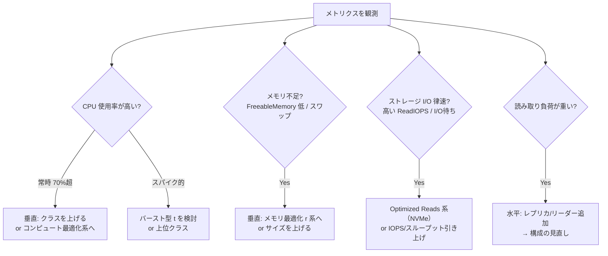

# AWS リレーショナルDB 容量選定ガイド（インスタンスクラス / ACU の選び方）

> **このドキュメントの位置づけ**: [`aws-rds-options-reference.md`](./aws-rds-options-reference.md) で「①構成（どのサービス/トポロジ）」を選んだ後の、**②容量の選定**を扱う実務ガイドです。「インスタンスクラスをどう選ぶか」「ACU レンジをどう決めるか」を、構成ごとに整理します。インスタンスファミリー・世代の特徴も先に解説します。
>
> **数値の時点**: 本文中の型番・上限値は **2026-06 時点** の AWS 公式ドキュメントに基づきます（末尾 [参照リンク集](#参照リンク集)）。新世代の型番やリージョン別の提供状況は変わるため、実設計時は最新を確認してください。

---

## 目次

- [0. 全体像：容量選定は「型番選び」ではなく「メトリクス駆動の調整」](#0-全体像容量選定は型番選びではなくメトリクス駆動の調整)
- [1. インスタンスクラスの読み方（命名規則）](#1-インスタンスクラスの読み方命名規則)
- [2. インスタンスファミリーの特徴](#2-インスタンスファミリーの特徴)
- [3. 世代（ジェネレーション）の特徴](#3-世代ジェネレーションの特徴)
- [4. サイズの選び方（共通の判断手順）](#4-サイズの選び方共通の判断手順)
- [5. 構成別の選び方](#5-構成別の選び方)
  - [5.1 RDS 単一 / Multi-AZ インスタンス](#51-rds-単一--multi-az-インスタンス)
  - [5.2 RDS Multi-AZ DB クラスター](#52-rds-multi-az-db-クラスター)
  - [5.3 Aurora プロビジョンド](#53-aurora-プロビジョンド)
  - [5.4 Aurora Serverless v2（ACU レンジ）](#54-aurora-serverless-v2acu-レンジ)
  - [5.5 Aurora Limitless（ACU）](#55-aurora-limitlessacu)
  - [5.6 Aurora Global Database（クラス と ACU）](#56-aurora-global-databaseクラス-と-acu)
- [参照リンク集](#参照リンク集)

---

## 0. 全体像：容量選定は「型番選び」ではなく「メトリクス駆動の調整」

容量選定の本質は、最初に完璧なスペックを当てることではなく、**小さく始めてメトリクスを見ながら正しい方向に動かす**ことです。動かす軸は 2 つだけ：

- **垂直（スケールアップ/ダウン）**: インスタンスクラスを上げ下げする（または ACU の Max を上げる）。**書き込みボトルネックの基本対処**。
- **水平（スケールアウト/イン）**: 読み取りレプリカ/リーダーを増減する。**読み取りボトルネックの基本対処**（→ 構成の選定は options-reference.md）。



> **鉄則**: 本番でいきなり大きいクラスを張らない。**観測 → 1 段ずつ調整**。RDS/Aurora はインスタンスクラスの変更が（再起動を伴うが）容易なので、過剰プロビジョニングはコストの無駄になりやすい。Serverless v2 はこの調整自体を自動化したもの（§5.4）。

---

## 1. インスタンスクラスの読み方（命名規則）

`db.r6g.large` のような型番は、**意味のある区切り**でできています。読めると選定が一気に楽になります。

```
db . r 6 g d . large
│    │ │ │ │   └─ サイズ（large, xlarge, 2xlarge … vCPU/メモリが倍々）
│    │ │ │ └───── サフィックス（d = ローカルNVMe SSD付き / n = 高帯域ネット 等）
│    │ │ └─────── プロセッサ（g = AWS Graviton, i = Intel, a = AMD, 無印 = Intel旧世代）
│    │ └───────── 世代（数字が大きいほど新しい：5→6→7→8→9）
│    └─────────── ファミリー（t=バースト, m=汎用, r/x/z=メモリ最適化, c=コンピュート最適化）
└──────────────── DB インスタンスであることを示す接頭辞
```

例：
- `db.t4g.medium` … バースト型・第4世代・Graviton2・medium サイズ
- `db.r6g.large` … メモリ最適化・第6世代・Graviton2・large サイズ
- `db.m8i.2xlarge` … 汎用・第8世代・Intel・2xlarge サイズ
- `db.r6gd.xlarge` … メモリ最適化・第6世代・Graviton2・**ローカル NVMe 付き**（Optimized Reads）・xlarge

> **サイズの感覚**: 1 段上げる（例 `large`→`xlarge`）ごとに **vCPU とメモリがおおむね 2 倍**、料金もおおむね 2 倍。`large` が基準サイズで、その下に `medium` / `small` /（バースト型のみ）`micro` があります。

---

## 2. インスタンスファミリーの特徴

RDS のインスタンスクラスは用途別に 5 系統あります。**「CPU・メモリ・I/O のどれが効くか」でファミリーを選ぶ**のが基本です。

| ファミリー | 記号 | 特徴 | 向いている DB ワークロード |
|---|---|---|---|
| **バースト** | `t`（t4g/t3/t2） | 普段は低い「ベースライン CPU」で動き、必要時だけフル CPU に**バースト**。安い。RDS では Unlimited モード（ベースラインを超えた分は追加課金で継続バースト可） | 開発・検証、断続的・低負荷、小規模本番。**常時高 CPU には不向き**（バーストクレジットを使い切ると遅くなる/課金が増える） |
| **汎用** | `m`（m9g/m8g/m7i…） | CPU・メモリ・ネットワークが**バランス型**（メモリ:vCPU ≒ 4GiB:1） | 偏りのない一般的な OLTP、Web アプリのバックエンド。最初の本番の定番 |
| **メモリ最適化** | `r` / `x` / `z` | **メモリ比率が高い**（r 系は 8GiB:1vCPU、x 系はさらに高くテラバイト級、z 系は高クロック） | 大きなバッファプール/キャッシュが効く DB、結合・集計が重い、メモリ常駐量が多い。**RDB の本番でよく効く** |
| **コンピュート最適化** | `c`（c6gd） | CPU 比率が高い。**RDS では `db.c6gd` のみ**で、しかも**Multi-AZ DB クラスター専用**（通常の単一/Multi-AZ インスタンスでは選べない）。`medium` サイズを持つ唯一のクラスター用クラス | CPU 律速かつクラスター構成、というニッチ |
| **Optimized Reads** | `d` サフィックス（r6gd / r6id / m8gd / r8gd 等） | **ローカル NVMe SSD** を搭載し、一時テーブルやソートのスピル（あふれ）を高速ローカルディスクで処理 → 読み取り/複雑クエリが速い | 大きな一時テーブルを使うクエリ、複雑な分析的読み取りが多い OLTP |

> **DB は基本「メモリ最適化（r 系）」が効きやすい**: RDB はバッファプール（データのメモリキャッシュ）が大きいほどディスク I/O が減り速くなるため、汎用 `m` で頭打ちならまず `r` 系を検討します。逆に開発・低負荷ならバースト `t` 系でコストを抑えるのが定石。なお **Aurora は `m`（汎用）や `c`（コンピュート最適化）を提供せず、`r` 系（メモリ最適化）/ `t` 系（バースト）/ `db.serverless` が選択肢**です。

---

## 3. 世代（ジェネレーション）の特徴

型番の数字（`6g` の `6`）が**世代**です。**原則として新しい世代ほど価格性能比が良く、同じ料金でより多くの vCPU・メモリ・EBS/ネットワーク帯域**が得られます。プロセッサ別に整理します。

| プロセッサ | 記号 | RDS の世代例 | 特徴 |
|---|---|---|---|
| **AWS Graviton** | `g` | Graviton2=`6g`/`x2g`/`t4g`、Graviton3=`7g`、Graviton4=`8g`、Graviton5=`9g` | Arm ベースの自社設計チップ。**同等の Intel/AMD より価格性能比が高く、コスト効率が良い**。MySQL/PostgreSQL/MariaDB はほぼ Graviton で問題なく動く。**迷ったら Graviton（`g` 付き）が第一候補** |
| **Intel** | `i`（または旧世代の無印） | `m8i`/`m7i`/`m6i`、`r7i`/`r6i`、`z1d`、`x2i` 系 | x86。SAP 認定など**特定エンタープライズ要件**や、x86 固有の拡張・互換性が要る場合に。高クロック（z1d）や超大メモリ（x2i：最大 4TiB）はこちら |
| **AMD** | `a` | （RDS では限定的） | x86 互換。Intel より安いことがある |

> **実務の指針**:
> - **まず Graviton 系（`g`）を選ぶ** — 価格性能比が最良で、マネージド RDB ではアプリ非互換の心配がほぼない（DB エンジンは AWS が Arm 対応済み）。
> - **最新世代を選ぶ** — 旧世代（`m4`/`m3`/`t2` 等）は提供終了プロセスに入っているものが多い。新規は最新〜1 つ前の世代から選ぶ。
> - **Intel を選ぶのは要件があるときだけ** — SAP 認定、超大メモリ（x2i）、特定の高クロックなど。

---

## 4. サイズの選び方（共通の判断手順）

ファミリー・世代を決めたら、最後に**サイズ**（vCPU/メモリ量）を決めます。**「最初の見積もり → 観測 → 調整」**が全構成共通の流れです。

### ステップ 1：初期サイズの当て方

- **既存 DB からの移行**: 現行の vCPU/メモリ/ピーク接続数/IOPS を基準に、同等〜やや上のサイズから。
- **新規**: まず小さめ（開発=`t` 系、本番=`m`/`r` 系の `large` あたり）から始め、負荷試験で確かめる。**過剰プロビジョニングは後で下げる手間より、最初に小さく始めて上げる方が安全**。

### ステップ 2：観測すべき主要メトリクス（CloudWatch / Performance Insights）

| メトリクス | 見るもの | 高いときの対処 |
|---|---|---|
| **CPUUtilization** | CPU が頭打ちか | 垂直アップ。スパイク的なら `t` 系、常時高なら上位クラス/コンピュート寄り |
| **FreeableMemory / SwapUsage** | メモリ不足 | メモリ最適化 `r` 系へ、またはサイズアップ。バッファプール不足はクエリ遅延に直結 |
| **ReadIOPS / WriteIOPS / DiskQueueDepth** | ストレージ I/O 律速 | ストレージの IOPS/スループット引き上げ、または Optimized Reads（NVMe）系 |
| **DatabaseConnections** | 接続数の上限張り付き | サイズアップ（max_connections はメモリ依存）、または **RDS Proxy** で接続プール |
| **ReplicaLag**（レプリカ） | 読み取り遅延 | レプリカのサイズをソースに合わせる/増設 |

### ステップ 3：垂直か水平か

- **書き込み・CPU・メモリが律速** → 垂直（クラス/サイズアップ）
- **読み取りが律速** → 水平（レプリカ/リーダー追加 → 構成の見直し）

---

## 5. 構成別の選び方

### 5.1 RDS 単一 / Multi-AZ インスタンス

**選ぶもの**: インスタンスクラス（ファミリー × 世代 × サイズ）。Multi-AZ インスタンスでもスタンバイは**プライマリと同じクラス**になります（個別指定不可）。

| 観点 | 指針 |
|---|---|
| **ファミリー** | 開発/検証・低負荷 → **`t` 系（バースト）**。一般本番 → **`m`（汎用）**。メモリが効く/`m`で頭打ち → **`r`（メモリ最適化）**。一時テーブル多用の読み取り → **Optimized Reads（`r6gd` 等）** |
| **世代/プロセッサ** | **Graviton（`t4g`/`m7g`/`r7g`/`r8g` 等）を第一候補**。Intel が要るのは SAP・超大メモリ等の要件があるときだけ |
| **サイズ** | `large` を起点に、§4 のメトリクスで上下。Multi-AZ は同一クラスが 2 台分課金になる点を織り込む |
| **注意** | `t` 系は常時高 CPU だとバーストクレジット枯渇 + Unlimited 課金で割高になりうる。本番の常時負荷には `m`/`r` を選ぶ |

**推奨スタート例（目安）**: 開発 `db.t4g.medium` / 小規模本番 `db.m7g.large`（or `db.r7g.large`） / メモリ重め本番 `db.r7g.xlarge`。

### 5.2 RDS Multi-AZ DB クラスター

**選ぶもの**: インスタンスクラス。ただし**対応クラスが NVMe ローカルストレージ（`d` サフィックス）系に限定**されます（公式の対応リスト）：`db.c6gd`, `db.m5d`, `db.m6gd`, `db.m6id`, `db.m6idn`, `db.m8gd`, `db.r5d`, `db.r6gd`, `db.r6id`, `db.r6idn`, `db.r8gd`, `db.x2iedn`。1 ライター + 2 リーダーが**全て同じクラス**になります。

| 観点 | 指針 |
|---|---|
| **ファミリー** | 汎用 → `m6gd`/`m8gd`、メモリ最適化 → `r6gd`/`r8gd`、CPU 寄り → `c6gd`（唯一 `medium` サイズあり＝小さく始めたいクラスター向き） |
| **世代/プロセッサ** | Graviton 系（`m6gd`/`r6gd`/`r8gd`/`c6gd`）が価格性能比で有利。Intel は `m6id`/`r6id`/`x2iedn` 等 |
| **サイズ** | `c6gd.medium` 以外は基本 `large` 以上。3 インスタンス分の課金になるためサイズ影響が大きい |
| **注意** | 通常の単一/Multi-AZ インスタンスとは**選べるクラス集合が違う**（`d` 無しの素の `m7g`/`r7g` などは不可）。設計時に対応表を必ず確認 |

**推奨スタート例（目安）**: 小さく始める → `db.c6gd.medium`、一般 → `db.m6gd.large`、メモリ重め → `db.r6gd.large` / `db.r8gd.large`。

### 5.3 Aurora プロビジョンド

**選ぶもの**: インスタンスクラス。**Aurora は `m`（汎用）も `c`（コンピュート最適化）も提供せず**、選択肢は **`r` 系（メモリ最適化）/ `t` 系（バースト）/ `db.serverless`（→ 5.4）** です。ライターとリーダーで**別々のクラス**を指定できます（リーダーを小さくしてコスト調整、なども可）。

| 観点 | 指針 |
|---|---|
| **ファミリー** | 開発/低負荷 → **`t` 系（`db.t4g.medium` 等）**。本番は基本 **`r` 系（メモリ最適化）一択**（Aurora に汎用 `m` は無い） |
| **世代/プロセッサ** | **Graviton を第一候補**：`db.r8g`（Graviton4）/ `db.r7g`（Graviton3）/ `db.r6g`（Graviton2）。Intel は `db.r7i`/`db.r6i`。低コスト大メモリは `db.x2g`（Graviton2） |
| **Optimized Reads** | 一時テーブル/スピルが多い読み取りには `db.r6gd`/`db.r6id`/`db.r8gd`（※ `r6gd`/`r6id` は **Aurora PostgreSQL のみ**対応） |
| **ライター/リーダーの非対称** | リーダーは読み取り専用なので、用途次第でライターより小さいクラスでコストを抑える選択も可。ただしフェイルオーバー先になるリーダーはライター相当を推奨 |
| **サイズ** | `db.r7g.large` を起点に §4 のメトリクスで調整。読み取りが足りなければ**サイズアップより先にリーダー追加（水平）**が定石 |

**推奨スタート例（目安）**: 開発 `db.t4g.medium` / 本番 `db.r7g.large`（ライター・リーダー各1）/ メモリ重め `db.r8g.xlarge` or `db.x2g.large`。

### 5.4 Aurora Serverless v2（ACU レンジ）

**選ぶもの**: 固定クラスではなく **ACU（Aurora Capacity Unit）の `Min`〜`Max` レンジ**。**1 ACU ≒ 約 2 GiB メモリ + 相応の vCPU/ネットワーク**。設定したレンジ内で Aurora が**秒単位に容量を自動増減**します。

| パラメータ | 取りうる値 | 決め方 |
|---|---|---|
| **MinCapacity** | **0 ACU**（オートポーズ対応バージョン）または **0.5 ACU**、以降 0.5 刻み | アイドル時のコスト下限。**0** にすると一定アイドル後に自動停止（コストほぼゼロ、ただし復帰に時間）。本番で常時即応が要るなら `0.5`〜必要メモリ分を確保。Min は「アイドル時もキャッシュを温存したい量」で決める |
| **MaxCapacity** | **最大 256 ACU**、0.5 刻み | ピーク時に許す上限。**コストの上限ガード**でもある。ピーク負荷想定（CPU/メモリ）から逆算。高すぎると暴走時に高額化、低すぎるとピークで頭打ち |
| **SecondsUntilAutoPause** | 300〜86,400 秒（Min=0 のときのみ有効） | 自動停止までのアイドル時間 |

**決め方のコツ**:
- **Min**: 「常時保持したいバッファプール量 ÷ 2GiB」が目安。開発なら `0`〜`0.5`、本番なら平常時の負荷をさばける下限（例 `2`〜`8`）。
- **Max**: 「ピーク時に同等プロビジョンドなら選ぶクラスのメモリ ÷ 2GiB」。例：ピークが `db.r7g.4xlarge`（128GiB）相当なら ~64 ACU。
- **注意**: 常時高負荷で張り付くワークロードは ACU 単価がやや割高なため、**固定プロビジョンド（5.3）の方が安い**ことがある。Serverless v2 は「変動が大きい/読めない/アイドルが長い」ときに効く。

**推奨スタート例（目安）**: 開発 `Min 0 / Max 4`、変動の大きい本番 `Min 2 / Max 32`、まず様子見 `Min 0.5 / Max 16`。

### 5.5 Aurora Limitless（ACU）

**選ぶもの**: シャードグループの**最大 ACU**。これを指定すると**ルーター数とシャード数の初期構成が決まり**、各ノードはその範囲内で自動スケールします（Aurora **PostgreSQL のみ**）。書き込みを水平分割できる唯一の構成。

| 作成時の最大 ACU | 初期ルーター数 | 初期シャード数 |
|---|---|---|
| 16〜400 ACU | 2 | 2 |
| （中間帯は段階的に増加） | … | … |
| 2301〜6144 ACU | 8 | 16 |

**決め方のコツ**:
- **最大 ACU は「書き込みスループットの想定総量」から決める**。シャード/ルーター数が後から大きく変えにくい（シャード分割やルーター追加は SQL で可能だが運用コスト大）ので、初期の最大 ACU 設定が重要。
- **コンピュート冗長**を有効にするとシャードが 2〜3 倍に増え（HA 用）、その分コストも増える。
- **大原則**: Limitless は**最後の手段**。まず Aurora の垂直強化（5.3 で `r` 系を上げる）+ 読み取りはリーダーで水平、で足りないか必ず先に検討する。単一ライターの書き込み上限が真にボトルネックのときだけ。

### 5.6 Aurora Global Database（クラス と ACU）

**選ぶもの**: グローバル DB は「プライマリ + 最大10セカンダリリージョン」の集合で、**各リージョンのクラスターごとに 5.3 / 5.4 と同じ要領で②を選びます**（プロビジョンドのクラス、または `db.serverless` の ACU レンジ）。リージョンごとに独立に決められます。

| 役割 | 容量の決め方 |
|---|---|
| **プライマリ（書き込み）** | 全リージョンの書き込みを一手に引き受けるので、**書き込み負荷に十分なサイズ**。5.3（`r` 系）または 5.4（ACU レンジ）で、ピーク書き込みを基準に |
| **セカンダリ（読み取り）** | そのリージョンの**読み取り負荷に合わせて独立に**サイズ/ACU を決める。読み取りが軽い DR 専用リージョンなら小さめ、現地ユーザーが多いリージョンは大きめ/リーダー増設。Serverless v2 にすればリージョン別の変動に自動追従できコスト効率が良い |
| **混在** | プライマリはプロビジョンド固定、セカンダリは Serverless v2、といった**リージョンごとに型を変える**構成も可能 |

**決め方のコツ**:
- プライマリは「書き込み + ライトフォワーディングで集まる書き込み」を基準にサイズ。DR フェイルオーバー後にプライマリに昇格するセカンダリは、**昇格後に書き込みを捌けるサイズ**を最低 1 つ確保しておく（小さすぎると昇格後に詰まる）。
- 各セカンダリは現地の読み取り需要に合わせて個別最適化。変動が読めないリージョンは Serverless v2 が有利。

---

## 参照リンク集

> 型番・上限は変わりうるため、設計時は必ず最新の公式ドキュメントを確認してください（本文の数値は 2026-06 時点）。

- DB インスタンスクラスの種類（汎用/メモリ最適化/コンピュート最適化/バースト/Optimized Reads、Graviton 世代）: <https://docs.aws.amazon.com/AmazonRDS/latest/UserGuide/Concepts.DBInstanceClass.Types.html>
- DB インスタンスクラスのハードウェア仕様（vCPU/メモリ/EBS帯域）: <https://docs.aws.amazon.com/AmazonRDS/latest/UserGuide/Concepts.DBInstanceClass.Summary.html>
- Aurora が対応する DB インスタンスクラス（db.serverless / r 系 / t 系、一部 PostgreSQL 限定）: <https://docs.aws.amazon.com/AmazonRDS/latest/AuroraUserGuide/Concepts.DBInstanceClass.SupportAurora.html>
- Multi-AZ DB クラスターの対応インスタンスクラス（NVMe ローカル系限定・c6gd のみ medium）: <https://docs.aws.amazon.com/AmazonRDS/latest/UserGuide/multi-az-db-clusters-concepts.html>
- Aurora Serverless v2 のスケーリング設定（Min 0/0.5〜Max 256 ACU・オートポーズ）: <https://docs.aws.amazon.com/AmazonRDS/latest/APIReference/API_ServerlessV2ScalingConfiguration.html>
- Aurora PostgreSQL Limitless（最大 ACU とルーター/シャード初期構成）: <https://docs.aws.amazon.com/AmazonRDS/latest/AuroraUserGuide/limitless-cluster.html>
- Aurora Global Database（プライマリ/セカンダリ構成）: <https://docs.aws.amazon.com/AmazonRDS/latest/AuroraUserGuide/aurora-global-database.html>
- 構成（①）の選定はこちら: [`aws-rds-options-reference.md`](./aws-rds-options-reference.md)
