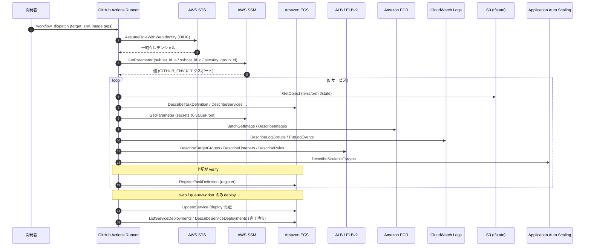
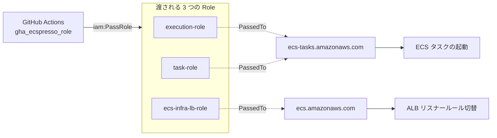

# ecspresso デプロイパイプライン解説

## 概要

本ドキュメントは、`.github/workflows/ecspresso-update-task.yml` ワークフローと `ecspresso/` 配下のタスク定義群、そしてそれらを動かすために `gha_ecspresso_role` に必要な IAM 権限を、運用担当・権限変更者向けに解説するものです。

3 行サマリ：

- `ecspresso/` 配下では Jsonnet で 5 サービス分（web / queue-worker / migration / seeder / batch-daily-report）のタスク定義と一部のサービス定義を DRY 化して記述しています。
- ワークフローは GitHub OIDC で `gha_ecspresso_role` を AssumeRole し、SSM からネットワーク情報を取得した上で `ecspresso verify → diff → register / deploy` を順番に実行します。
- web サービスのみ ECS native Blue/Green でデプロイし、その他は Rolling か Run Task 方式です。

### 関連ドキュメント早見表

| ドキュメント | 触れている内容 |
|---|---|
| [ecspresso-jsonnet-refactor.md](./ecspresso-jsonnet-refactor.md) | Jsonnet 化の経緯・文法・トラブルシュート |
| [codedeploy_ecs_deployment.md](./codedeploy_ecs_deployment.md) | 旧 CodeDeploy 方式の Blue/Green（参考） |
| [iam_passrole_for_ecs.md](./iam_passrole_for_ecs.md) | `iam:PassRole` 二重ロックの概念 |
| [github_actions_secrets.md](./github_actions_secrets.md) | OIDC sub クレーム制御・環境別ロール |
| [ecs-config-variables.md](./ecs-config-variables.md) | ECS タスクサイズ・スケール設定 |

---

## 全体アーキテクチャ

GitHub Actions のジョブ起点から AWS 上の各サービスへ、どんな順序で API が呼ばれるかを示します。



### 5 サービスの役割

| サービス | 起動方式 | デプロイ方式 | ワークフロー処理 |
|---|---|---|---|
| `runner` | Run Task（`db-task.yml` から containerOverrides で migrate / seed / shell を切替実行） | - | register only |
| `batch-daily-report` | EventBridge → Run Task | - | register only |
| `web` | ECS Service | **ECS native Blue/Green** | register + deploy |
| `queue-worker` | ECS Service | Rolling | register + deploy |

runner / batch は ECS Service ではなく Run Task で都度起動するため `service-def.jsonnet` を持たず、ワークフローでは新リビジョンの登録までで止めます。実行は別ワークフロー（`db-task.yml`）が `aws ecs run-task` を呼ぶ責務です。

---

## `ecspresso/` ディレクトリ構成

### ファイルレイアウト

```
ecspresso/
├── _common.libsonnet              # env 横断の共通モジュール（function(p) で受ける）
└── stg/
    ├── _params.libsonnet          # stg 固有値（projectName, domain など）
    ├── web/
    │   ├── ecspresso.yml          # cluster / service / plugins
    │   ├── ecs-task-def.jsonnet   # nginx + laravel + fluent-bit + ADOT
    │   └── service-def.jsonnet    # Blue/Green 設定
    ├── queue-worker/
    │   ├── ecspresso.yml
    │   ├── ecs-task-def.jsonnet
    │   └── service-def.jsonnet    # Rolling
    ├── migration/
    │   ├── ecspresso.yml
    │   └── ecs-task-def.jsonnet   # Run Task 用、service-def なし
    ├── seeder/
    │   ├── ecspresso.yml
    │   └── ecs-task-def.jsonnet
    └── batch-daily-report/
        ├── ecspresso.yml
        └── ecs-task-def.jsonnet
```

Terraform でいう「modules + tfvars」のパターンに近く、`_common.libsonnet` がモジュール本体、`_params.libsonnet` が tfvars、各 `ecs-task-def.jsonnet` がモジュール呼び出しに対応します。

### `_common.libsonnet` で共通化している要素

| 種類 | 内容 |
|---|---|
| 環境変数グループ | `dbEnv` / `logEnv` / `appEnv` / `otelEnv` / `sqsEnv` / `mailEnv` / `sessionEnv` |
| 派生 URL | `frontendUrl` / `backendUrl`（params の subdomain と domain から生成） |
| 共通 secrets | `baseSecrets`（`DB_PASSWORD` / `APP_KEY` の SSM ARN を tfstate から） |
| ログ設定 | `awslogs(prefix)` / `firelens(prefix)`（CloudWatch Logs 直書き / Fluent Bit ルーター経由） |
| タスク定義骨格 | `taskDefBase(family, cpu, memory)`（Fargate / awsvpc / role ARN を埋める） |
| サービス定義パーツ | `fargateSpot` / `deploymentCircuitBreaker` / `networkConfig` |

抜粋（task definition の共通骨格）：

```jsonnet
taskDefBase(family, cpu, memory):: {
  family: family,
  networkMode: 'awsvpc',
  requiresCompatibilities: ['FARGATE'],
  cpu: cpu,
  memory: memory,
  // tfstate プラグインはネストしたモジュール出力を解決できないため、
  // ARN を AWS_ACCOUNT_ID + projectName から組み立てる
  executionRoleArn: 'arn:aws:iam::{{ must_env `AWS_ACCOUNT_ID` }}:role/' + p.projectName + '-execution-role',
  taskRoleArn:      'arn:aws:iam::{{ must_env `AWS_ACCOUNT_ID` }}:role/' + p.projectName + '-task-role',
},
```

### `stg/_params.libsonnet`（stg 固有値）

| キー | 値 | 用途 |
|---|---|---|
| `envName` | `stg` | 環境識別 |
| `appEnv` | `staging` | Laravel `APP_ENV` |
| `appName` | `practice` | Laravel `APP_NAME` |
| `projectName` | `practice-stg` | OTEL_SERVICE_NAME, role 命名 |
| `domain` | `mylabinfra.com` | ルートドメイン |
| `frontendSubdomain` | `www` | `https://www.mylabinfra.com` |
| `backendSubdomain` | `api` | `https://api.mylabinfra.com` |
| `sqsQueueName` | `staging-qrcode-generation` | `queue-worker` の SQS キュー |
| `mailFromName` | `practice-stg` | メール From 表示 |

prod を作るときは `ecspresso/prod/_params.libsonnet` をコピーして値を書き換えるだけで、`_common.libsonnet` は触らずに済みます。

### 各サービスの `ecspresso.yml`

5 サービスとも同じ形で、`tfstate` プラグインだけを読み込みます。

```yaml
region: ap-northeast-1
cluster: practice-stg-cluster
service: practice-stg-main-service          # Run Task 系（migration 等）はこの行なし
task_definition: ecs-task-def.jsonnet
service_definition: service-def.jsonnet     # Run Task 系はこの行なし
plugins:
  - name: tfstate
    config:
      url: s3://github-action-terraform-tf-state-bucket/practice/laravel/stg/terraform.tfstate
```

`cluster` / `service` をハードコードしているのは、ecspresso v2 系では `ecspresso.yml` 自体のフィールド内では `{{ tfstate ... }}` テンプレートが効かないためです（task definition 内では効きます）。詳細は [ecspresso-jsonnet-refactor.md のトラブルシュート節](./ecspresso-jsonnet-refactor.md#トラブルシュート-function-tfstate-not-defined) を参照。

### `service-def.jsonnet` (web) — ECS native Blue/Green の中核

```jsonnet
local p = import '../_params.libsonnet';
local c = (import '../../_common.libsonnet')(p);

{
  desiredCount: 1,
  enableExecuteCommand: true,
  capacityProviderStrategy: [c.fargateSpot],
  deploymentConfiguration: {
    minimumHealthyPercent: 100,
    maximumPercent: 200,
    strategy: 'BLUE_GREEN',           // ← ECS ネイティブ B/G
    bakeTimeInMinutes: 0,             // ← Slot 切替後の様子見時間（0=即切替）
    deploymentCircuitBreaker: c.deploymentCircuitBreaker,
  },
  networkConfiguration: c.networkConfig,
  loadBalancers: [
    {
      targetGroupArn: '{{ tfstate `module.app.aws_lb_target_group.slot_a.arn` }}',
      containerName: 'nginx-container',
      containerPort: 80,
      advancedConfiguration: {
        alternateTargetGroupArn: '{{ tfstate `module.app.aws_lb_target_group.slot_b.arn` }}',
        productionListenerRule:  '{{ tfstate `module.app.aws_lb_listener_rule.ecs_production.arn` }}',
        testListenerRule:        '{{ tfstate `module.app.aws_lb_listener_rule.ecs_test.arn` }}',
        roleArn: 'arn:aws:iam::{{ must_env `AWS_ACCOUNT_ID` }}:role/' + p.projectName + '-ecs-infra-lb-role',
      },
    },
  ],
}
```

| フィールド | 役割 |
|---|---|
| `deploymentConfiguration.strategy` | `BLUE_GREEN` を指定すると ECS 自体が Blue/Green を実行する（CodeDeploy 不要） |
| `bakeTimeInMinutes` | 新版を本番リスナーへ繋いだ後、自動ロールバック判定をする待機分。`0` は即時 |
| `deploymentCircuitBreaker` | デプロイ失敗時の自動ロールバック有無 |
| `loadBalancers[0].targetGroupArn` | 現用（slot_a）TG。Blue/Green 切替の片方 |
| `advancedConfiguration.alternateTargetGroupArn` | もう片方の TG（slot_b）。新版はまずこちらで起動 |
| `advancedConfiguration.productionListenerRule` | 本番トラフィックのリスナールール ARN |
| `advancedConfiguration.testListenerRule` | テスト用リスナールール ARN |
| `advancedConfiguration.roleArn` | ECS が ALB を操作する際に引き受ける IAM ロール（`ecs.amazonaws.com` に PassRole される） |

queue-worker の `service-def.jsonnet` は `strategy` を省略しており、ECS 標準の Rolling Update で動作します。

旧 CodeDeploy 方式との対比は [codedeploy_ecs_deployment.md](./codedeploy_ecs_deployment.md) を参照。

---

## GitHub Actions ワークフロー詳解

### トリガと入力

| 入力 | 必須 | 用途 |
|---|---|---|
| `IMAGE_TAG_NGINX` | ○ | nginx コンテナの ECR イメージタグ |
| `IMAGE_TAG_LARAVEL` | ○ | laravel コンテナの ECR イメージタグ |
| `target_env` | ○ | `stg` / `prod` から選択（`environment:` に渡される） |

`workflow_dispatch` 専用で、自動トリガーはありません。`environment:` を選択することで OIDC sub クレームが `repo:OWNER/REPO:environment:<target_env>` 形式になり、後述の trust policy で AssumeRole 可否が判定されます。

### ジョブステップ図解

| # | ステップ | 用途 | 主に呼ぶ AWS API |
|---|---|---|---|
| 1 | `actions/checkout` | リポジトリ取得 | - |
| 2 | `aws-actions/configure-aws-credentials` | OIDC で AssumeRole | `sts:AssumeRoleWithWebIdentity` |
| 3 | `Export AWS account id` | step output → `AWS_ACCOUNT_ID` を `GITHUB_ENV` へ | （action 内部） |
| 4 | `kayac/ecspresso@v2` (v2.8.3) | CLI セットアップ | - |
| 5 | `Fetch ECS network config from SSM` | subnet / SG ID を `GITHUB_ENV` へ | `ssm:GetParameter` |
| 6 | migration: verify → diff → register | Run Task 用タスク定義の登録 | ECS / SSM / S3 / Logs / IAM |
| 7 | seeder: verify → diff → register | 同上 | 同上 |
| 8 | batch-daily-report: verify → diff → register | EventBridge から起動される Run Task | 同上 |
| 9 | web: verify → diff → deploy | Service 更新 + B/G 完了待ち | + `ecs:UpdateService`, ELB Describe, B/G API |
| 10 | queue-worker: verify → diff → deploy | Service 更新（Rolling） | + `ecs:UpdateService` |

5 サービスとも `ecspresso verify` を最初に通すことで、AWS 側の実体（SSM パラメータ実在、IAM ロール実在、ECR イメージ実在、ロググループ実在、ALB / TG / Listener Rule 実在）を事前に検証してから登録に進みます。

### `ecspresso v2.8.3` を使う理由

ECS native Blue/Green デプロイは `aws-sdk-go-v2/service/ecs v1.67.0` 以降が必要で、ecspresso では v2.6.3 でこれに更新されました。具体的には以下の機能/API に依存しています。

- `deploymentConfiguration.strategy = BLUE_GREEN`
- `bakeTimeInMinutes`
- `loadBalancers[].advancedConfiguration`
- `ecs:ListServiceDeployments` / `DescribeServiceDeployments` / `DescribeServiceRevisions`（デプロイ完了待ちでポーリング）

ワークフローでは v2.8.3 を pin しています。

### `runner` / `batch` を register のみで止める理由

これらは ECS Service ではなく Run Task として一回限りの実行をする設計のため、`ecspresso deploy` でサービスを継続起動すると意味がありません。新リビジョンを登録までして、実行は別ワークフロー（`db-task.yml` が migrate / seed / shell を `aws ecs run-task --overrides` で起動）に分担しています。

### OIDC trust policy

`gha_ecspresso_role` の信頼条件は二重ロックです。

```hcl
# terraform/modules/app-infrastructure/iam_github_actions.tf より抜粋
oidc_subjects           = [local.oidc_sub_environment]   # repo:OWNER/REPO:environment:stg
trust_policy_conditions = local.trust_conditions_main_only # token...:ref = refs/heads/main
```

これにより「指定 environment 経由かつ main ブランチ」でしか AssumeRole できません。詳しい解説は [github_actions_secrets.md](./github_actions_secrets.md) を参照。

---

## AssumeRole 先ロールに必要な権限（本書の主役）

`gha_ecspresso_role` が引き受ける IAM ポリシー `gha_ecspresso_policy` には ECS 以外にも IAM / SSM / ELB / ECR / Logs / S3 / Auto Scaling と多数の権限が含まれています。これは ecspresso が単に「タスク定義を register する」だけでなく、`verify` で AWS 側の実体を検証し、Blue/Green デプロイの完了をポーリングし、`tfstate` プラグインが S3 を読み、ワークフロー側ステップが SSM を呼ぶ──といった複数の責務を一つのロールで担っているためです。

### サブコマンド × 必要 API カテゴリ早見表

| カテゴリ | 主な API | verify | diff | register | deploy (B/G) | deploy (Rolling) |
|---|---|:-:|:-:|:-:|:-:|:-:|
| ECS タスク定義 | `RegisterTaskDefinition` / `DescribeTaskDefinition` | ○ | ○ | ○ | ○ | ○ |
| ECS サービス操作 | `UpdateService` / `DescribeServices` | ○ | ○ | - | ○ | ○ |
| ECS Blue/Green | `ListServiceDeployments` / `DescribeServiceDeployments` / `DescribeServiceRevisions` | - | - | - | ○ | - |
| ECS タスク確認 | `DescribeTasks` / `ListTasks` | ○ | - | - | ○ | ○ |
| `iam:PassRole` (tasks) | execution / task role → `ecs-tasks` | - | - | ○ | ○ | ○ |
| `iam:PassRole` (LB) | infra-lb role → `ecs.amazonaws.com` | - | - | - | ○ | - |
| `iam:GetRole` | execution / task role の存在確認 | ○ | - | - | - | - |
| SSM (network) | `GetParameter` (subnet / SG) | （workflow ステップ） | - | - | - | - |
| SSM (secrets) | `GetParameters` (valueFrom 解決) | ○ | - | - | - | - |
| ELBv2 | `DescribeTargetGroups` / `DescribeListeners` / `DescribeRules` | ○ | - | - | ○ | ○ |
| CloudWatch Logs | `DescribeLogGroups` / `CreateLogStream` / `PutLogEvents` | ○ | - | - | - | - |
| ECR | `GetAuthorizationToken` / `DescribeImages` / `BatchGetImage` | ○ | - | - | - | - |
| S3 (tfstate) | `GetObject` / `ListBucket` | ○ | ○ | ○ | ○ | ○ |
| Application AutoScaling | `DescribeScalableTargets` / `DescribeScalingPolicies` | ○ | - | - | - | - |

以下、カテゴリごとに「実 API」「対応サブコマンド」「Resource を絞っているか」を整理します。

### ECS タスク定義・サービス操作

| API | Resource | 用途 |
|---|---|---|
| `RegisterTaskDefinition` / `DescribeTaskDefinition` / `DeregisterTaskDefinition` / `ListTaskDefinitions` | `*`（family レベルの ARN は AWS 仕様で resource 制約不可） | `register` で新リビジョン登録、`diff` / `deploy` で現行 ACTIVE 取得 |
| `UpdateService` / `DescribeServices` / `ListServices` / `ListServiceDeployments` | `aws_ecs_service.main.id`, `aws_ecs_service.queue_worker.id` （`ecs:cluster` Condition で `practice-stg-cluster` に限定） | `deploy` でサービスのタスク定義差し替え、完了待ち |
| `DescribeClusters` / `ListClusters` | `aws_ecs_cluster.main.arn` | クラスタ実在確認（verify） |
| `DescribeTasks` / `ListTasks` | `*` （`ecs:cluster` Condition で限定） | タスク状態確認（verify / deploy） |

`UpdateService` 系は ARN 単位＋ Cluster Condition で「practice-stg-cluster の main / queue_worker サービス」だけに絞っています。誤って別サービスを更新してしまう事故を防ぐためです。

### ECS Native Blue/Green 用 API

ECS native Blue/Green では、ecspresso が「デプロイがまだ進行中か / 終わったか / 成功か / 失敗か」を `ecs:DescribeServiceDeployments` 系で polling します。

| API | Resource | 用途 |
|---|---|---|
| `ecs:ListServiceDeployments` | サービス ARN（resource-level 対応） | デプロイ ID 列挙 |
| `ecs:DescribeServiceDeployments` | `*`（AWS 仕様で resource-level 非対応） | デプロイ状態取得 |
| `ecs:DescribeServiceRevisions` | `*`（同上） | リビジョン詳細取得 |

`ListServiceDeployments` だけ ARN で絞れますが、`Describe*` は AWS 側仕様で `*` 必須です。これらは履歴上、以下のコミットで段階的に追加されました（後述の履歴表参照）。

### `iam:PassRole`（最も誤解されやすい権限）

ecspresso 経由でのデプロイには異なる 2 系統の `PassRole` が必要です。

| 渡す Role | PassedToService | 用途 |
|---|---|---|
| `${projectName}-execution-role` | `ecs-tasks.amazonaws.com` | ECS タスク起動時の Execution Role（ECR pull / Logs 書き込み / Secrets 取得） |
| `${projectName}-task-role` | `ecs-tasks.amazonaws.com` | タスク内のアプリが AWS API を叩く際のロール |
| `${projectName}-ecs-infra-lb-role` | `ecs.amazonaws.com` | ECS native Blue/Green で ECS が ALB のリスナールールを切り替える際のサービスロール |

```hcl
# 抜粋: terraform/modules/app-infrastructure/iam_policy_github_actions.tf
{
  Sid    = "PassEcsTaskRoles"
  Action = ["iam:PassRole"]
  Resource = [module.ecs_task_execution_role.arn, module.ecs_task_role.arn]
  Condition = { StringEquals = { "iam:PassedToService" = "ecs-tasks.amazonaws.com" } }
},
{
  Sid    = "PassEcsInfraLbRole"
  Action = ["iam:PassRole"]
  Resource = [module.ecs_infra_lb.arn]
  Condition = { StringEquals = { "iam:PassedToService" = "ecs.amazonaws.com" } }
},
```



`PassedToService` Condition で「ecs-tasks（タスク用）」と「ecs（サービス／ALB 操作用）」を厳密に分けることで、PassRole の権限が他のサービスに流用されるのを防いでいます。`*` でなく ARN で絞っている根拠と二重ロックの考え方は [iam_passrole_for_ecs.md](./iam_passrole_for_ecs.md) を参照。

加えて `iam:GetRole` も 2 つの ECS タスク系ロールに対して付与されています。これは `ecspresso verify` がロール実在をチェックするためです。

### SSM ParameterStore（用途は 2 つに分かれる）

SSM 権限は **ワークフローのステップで使うもの** と **`ecspresso verify` が secrets 解決で使うもの** の 2 種類があり、どちらも同じロールが扱います。

| 用途 | 対象パラメータ | 呼び出し元 |
|---|---|---|
| ECS network config 取得 | `/practice/${env}/subnet_id_a`, `/practice/${env}/subnet_id_c`, `/practice/${env}/security_group_id` | ワークフロー第 5 ステップ `Fetch ECS network config from SSM` |
| secrets 検証 | `db_password` / `app_key` / `google_client_id` / `google_client_secret` / `otel_collector_config` の各 ARN | `ecspresso verify`（task definition の `secrets[].valueFrom` を実際に Get） |

ワークフロー側 SSM 取得が必要な理由は、subnet / security group が `module.vpc` 配下にあって `tfstate` プラグインから引けないため、Terraform 側で SSM Parameter にエクスポートして外から参照する設計になっているからです。

### ELBv2

```hcl
Action = [
  "elasticloadbalancing:DescribeTargetGroups",
  "elasticloadbalancing:DescribeListeners",
  "elasticloadbalancing:DescribeRules",
]
Resource = "*"  # ELBv2 Describe 系は resource-level 非対応
```

`ecspresso verify` が `service-def.jsonnet` 内の `loadBalancers[].targetGroupArn` と `advancedConfiguration` 内の `productionListenerRule` / `testListenerRule` / `alternateTargetGroupArn` を実在チェックするために必要です。Blue/Green 設定では特に Listener Rule の正しさを事前に検証できることが価値です。

### CloudWatch Logs

| API | Resource | 用途 |
|---|---|---|
| `logs:DescribeLogGroups` | `*`（List 系で必須） | タスク定義の awslogs 設定で指定された LG の存在確認 |
| `logs:CreateLogStream` / `logs:PutLogEvents` | `${aws_cloudwatch_log_group.ecs_log.arn}:*` | `ecspresso verify` が `ecspresso-verify-<timestamp>` ストリームを作って書き込みテストする |

「verify でしか発火しない」権限ですが、これが無いと verify 段階で落ちて register に進めません。

### ECR

| API | Resource | 用途 |
|---|---|---|
| `ecr:GetAuthorizationToken` | `*`（AWS 仕様で必須） | ECR 認証トークン取得 |
| `ecr:BatchCheckLayerAvailability` / `ecr:BatchGetImage` / `ecr:GetDownloadUrlForLayer` / `ecr:DescribeImages` | `data.aws_ecr_repository.laravel.arn`, `data.aws_ecr_repository.nginx.arn` | タスク定義に書かれた `<repo>:<tag>` の実在確認 |

`IMAGE_TAG_NGINX` / `IMAGE_TAG_LARAVEL` が「ECR にまだ push されていないタグ」だった場合、verify が早期に失敗するためデプロイ事故を防げます。

### S3（`tfstate` プラグイン）

```hcl
Resource = "arn:aws:s3:::${var.tfstate_bucket}/${var.tfstate_key}"
```

`tfstate` プラグインが Terraform state ファイルを直接読みに行きます。`s3:GetObject` を tfstate オブジェクト 1 つに、`s3:ListBucket` を該当プレフィックスに限定しているため、別の state を覗く危険はありません。

### Application Auto Scaling

```hcl
Action = [
  "application-autoscaling:DescribeScalableTargets",
  "application-autoscaling:DescribeScalingPolicies",
]
Resource = "*"
```

ECS サービスに Auto Scaling が紐づいている場合、`ecspresso verify` がスケーラブルターゲットの設定を読んで `service-def` と整合するか確認します。

### 権限追加の歴史（最近のコミット）

ECS native Blue/Green 対応のため、直近で複数のポリシー更新が必要でした。

| コミット | 変更内容 | 背景 |
|---|---|---|
| `6c1b5c2` | `elasticloadbalancing:Describe*` を IAM ポリシーに追加 | service-def.jsonnet 内の `loadBalancers` と Listener Rule を verify で検証するため |
| `f9807a3` | ecspresso CLI を `v2.8.3` に更新（IAM ポリシーは変更なし） | ECS native Blue/Green に対応した版へバージョンアップ |
| `9313a7d` | `iam:PassRole` → `ecs_infra_lb`（`ecs.amazonaws.com` 限定）を追加 | ECS が ALB リスナールールを切り替えるためのサービスロール受け渡し |
| `caa4996` | `ecs:ListServiceDeployments` / `DescribeServiceDeployments` を追加 | Blue/Green 完了待ちのポーリング |

ecspresso のバージョン更新時に「verify が落ちる」「deploy が完了待ちで止まる」といった症状が出たら、まずこれらの権限不足を疑うのが定石です。

---

## 運用上の注意点

### register と deploy の分離

runner / batch は `register` までで止め、実行は別ワークフロー（`db-task.yml`）で行います。タスク定義の更新と DB マイグレーション実行が同じトリガーに紐づくと、ロールバックが難しくなるためです。

### Jsonnet 変更時の確認フロー

```bash
# 1. ローカルでレンダリングして JSON 化を確認
IMAGE_TAG_NGINX=sha-xxx IMAGE_TAG_LARAVEL=sha-xxx \
  ecspresso render --config ecspresso/stg/web/ecspresso.yml --task-definition

# 2. AWS 側との差分を確認（要 read 権限）
ecspresso diff --config ecspresso/stg/web/ecspresso.yml

# 3. 問題なければワークフローを workflow_dispatch
```

ローカル実行手順の詳細は [ecspresso-jsonnet-refactor.md の動作確認方法](./ecspresso-jsonnet-refactor.md#動作確認方法) を参照。

### 権限追加が必要になったときの手順

1. `terraform/modules/app-infrastructure/iam_policy_github_actions.tf` の `gha_ecspresso_policy` に Statement を追加
2. `terraform plan` で差分確認
3. `terraform apply`
4. GitHub Actions で `ecspresso-update-task` を再実行し、`verify` ステップが緑になることを確認

`Resource = "*"` はできるだけ避け、AWS 仕様で resource-level 制約が効かない API（`ecs:DescribeServiceDeployments` / ELB Describe 系 / `logs:DescribeLogGroups` 等）に限って使う方針にしています。

### よくある失敗

| 症状 | 原因の典型 |
|---|---|
| `verify` で `iam:GetRole` が AccessDenied | 新しいロール ARN を `GetEcsTaskRolesForVerify` に追加し忘れ |
| `verify` で SSM `AccessDeniedException` | 新規 secret パラメータを `SsmReadSecretsForVerify` に追加し忘れ |
| `deploy` がデプロイ完了待ちで止まる | `ecs:DescribeServiceDeployments` 系が不足（v2.6+ で必要） |
| `deploy` 開始直後に `iam:PassRole` で失敗 | `ecs.amazonaws.com` 用 PassRole（infra-lb）の追加し忘れ |
| `verify` が ELB Describe で落ちる | Blue/Green 設定追加時に ELB Describe 系の追加忘れ |

### ecspresso のバージョン更新

ecspresso のメジャー / マイナー更新時には、内部で使う AWS API が増えていることがあります（実例: v2.6.3 で B/G 用 API が追加）。バージョンアップ前に [ecspresso CHANGELOG](https://github.com/kayac/ecspresso/blob/master/CHANGELOG.md) の差分を確認し、必要であれば本ドキュメントの「権限追加の歴史」のように IAM 側を先行で更新してください。

---

## 関連ドキュメント

- [ecspresso-jsonnet-refactor.md](./ecspresso-jsonnet-refactor.md) — Jsonnet 化の経緯・文法・トラブルシュート
- [codedeploy_ecs_deployment.md](./codedeploy_ecs_deployment.md) — 旧 CodeDeploy 方式の Blue/Green
- [iam_passrole_for_ecs.md](./iam_passrole_for_ecs.md) — `iam:PassRole` の二重ロックの考え方
- [github_actions_secrets.md](./github_actions_secrets.md) — OIDC sub クレームと環境別ロール
- [ecs-config-variables.md](./ecs-config-variables.md) — ECS タスクサイズ・スケール設定
- ecspresso 公式: <https://github.com/kayac/ecspresso>
- ecspresso 設定リファレンス: <https://github.com/kayac/ecspresso/blob/master/docs/Configuration.md>
