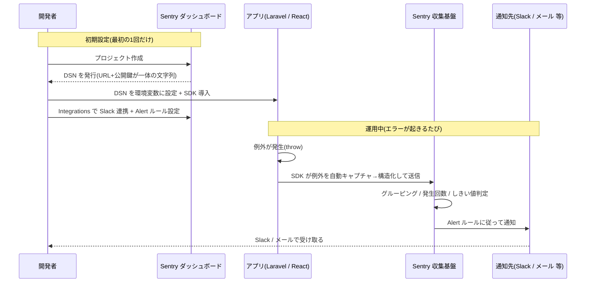
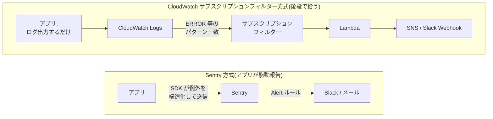

# Sentry によるエラー監視・通知

## 概要

**Sentry** は、アプリケーションで発生したエラー(例外)を自動で収集・集約し、Slack やメールなどへ通知してくれる **エラー監視 (Error Monitoring) の SaaS** である。

「ログをどこかに出しておいて、後から人間が grep する」のではなく、**アプリ自身が「いま例外が起きた」という事実を、スタックトレースや発生時の状況ごとサーバへ能動的に報告する**点が本質。報告されたエラーは Sentry 側で「同じ原因のものはまとめる(グルーピング)」「何回起きたか」「再発したか」が自動集計され、しきい値に応じて通知が飛ぶ。

このドキュメントは「概念理解」を主目的とし、Laravel(`backend/www`)を中心に動くレベルのコード例を添える。**実際の導入(`composer require` 等)はこのドキュメントの範囲外。**

## 目次

- [0. 結論(3行)](#0-結論3行)
- [1. 全体像(導入〜通知の流れ)](#1-全体像導入通知の流れ)
- [2. なぜ「throw するだけ」で送られるのか](#2-なぜthrow-するだけで送られるのか)
- [3. 導入手順](#3-導入手順)
- [4. コード例(動くレベル)](#4-コード例動くレベル)
- [5. CloudWatch サブスクリプションフィルター方式との違い](#5-cloudwatch-サブスクリプションフィルター方式との違い)
- [6. 代替サービス・ライブラリ比較](#6-代替サービスライブラリ比較)
- [7. 料金](#7-料金)
- [8. 通知先(インテグレーション)一覧](#8-通知先インテグレーション一覧)
- [9. 関連ファイル](#9-関連ファイル)

---

## 0. 結論(3行)

1. SDK を初期化すれば、**catch されずに上まで抜けた例外は自動で Sentry に送られる**。`try/catch` で握りつぶした例外だけ手動送信(`captureException`)する。
2. 発行されるのは「URL と API キー」ではなく **DSN という1本の文字列**(URL の中に公開鍵が埋まっている)。通知設定は Sentry 側の **Integrations + Alerts** で行う。
3. 「ログを出すだけ」で似たことをするなら **Monolog の Slack チャンネル**(このリポジトリの `config/logging.php` に定義済み)で実現できる。ただしグルーピング・集約・再発検知は付かない。

---

## 1. 全体像(導入〜通知の流れ)

質問にあった「プロジェクト作成 → URL と API キー発行 → 環境変数 → Slack/メール設定 → SDK 導入 → ログを投げる → 届く → 各種送信」という理解は **おおむね正しい**。用語と1点だけ補正したのが下図。



### ここで直した2つの用語

| あなたの言葉 | 正確には | 補足 |
|---|---|---|
| URL と API キー | **DSN (Data Source Name)** | `https://<公開鍵>@o12345.ingest.sentry.io/678` の形。URL の中に公開鍵が埋まった1本の文字列。これ単体でエラー送信ができる(公開しても致命的ではないが、環境変数で管理する)。 |
| (別物の)API キー | **Auth Token** | こちらは通知用ではなく、**ソースマップのアップロードやリリース登録など管理操作**に使うトークン。DSN とは役割が違うので混同しない。 |

> **「ログを投げるコードを書く」は必須ではない。** 多くのエラーは throw されるだけで自動送信される(詳細は次章)。

---

## 2. なぜ「throw するだけ」で送られるのか

> Q. Sentry はライブラリを入れたら、エラーを throw するだけで送ってくれるのか?
> **A. ほぼ Yes。ただし「catch されずに上まで抜けた例外」に限る。**

### 仕組み:フレームワークの例外ハンドラにフックする

Sentry SDK を初期化すると、フレームワークが持つ **「最後に例外を受け取る場所(グローバル例外ハンドラ)」に自分を割り込ませる**。Laravel の場合、リクエスト処理中に投げられた例外は、どこでも catch されなければ最終的に Laravel の例外ハンドラに到達する。Sentry はそこにフックしているので、**自動でキャプチャ → 構造化 → 送信**する。

このとき送られるのは「エラーメッセージの文字列」だけではない。例外オブジェクトから次のような **構造化データ** が抽出される。

- スタックトレース(どのファイルの何行目か、関数の呼び出し履歴)
- リクエスト情報(URL・HTTP メソッド・パラメータ・ヘッダ)
- ユーザー情報・リリースバージョン・環境(production / staging)
- ブレッドクラム(直前に通った処理のパンくず)

### 自動キャプチャ vs 手動キャプチャ

| ケース | 送られるか | 対応 |
|---|---|---|
| 例外が catch されず上まで抜けた | **自動で送られる** | 何もしなくてよい |
| `try/catch` で握りつぶした例外 | **送られない** | `\Sentry\captureException($e)` を手動で呼ぶ |
| 例外ではない異常を記録したい | 送られない | `\Sentry\captureMessage('...')` を手動で呼ぶ |

つまり **「投げっぱなしの例外」は自動、「自分で握った例外」は明示送信** が正確な理解。

---

## 3. 導入手順

(※ 以下は手順の答え合わせ。実際の導入はこのドキュメントの範囲外)

### バックエンド(Laravel)

1. **Sentry でプロジェクトを作成** → **DSN** が発行される。
2. **SDK をインストール**
   ```bash
   composer require sentry/sentry-laravel
   ```
3. **設定ファイルを生成し、DSN を環境変数に登録**
   ```bash
   php artisan sentry:publish --dsn=https://<key>@o<orgId>.ingest.sentry.io/<projectId>
   ```
   これで `config/sentry.php` が作られ、`.env` に次が入る。
   ```dotenv
   SENTRY_LARAVEL_DSN=https://<key>@o<orgId>.ingest.sentry.io/<projectId>
   ```
4. **例外ハンドラに Sentry を連携**(Laravel 11 / 12 は `bootstrap/app.php`。Laravel 12 採用)
   ```php
   // bootstrap/app.php
   ->withExceptions(function (Illuminate\Foundation\Configuration\Exceptions $exceptions) {
       \Sentry\Laravel\Integration::handles($exceptions);
   })
   ```
5. **通知設定(Sentry 側の Web UI)**
   - **Integrations**:Slack を接続(ワークスペース認可)
   - **Alerts**:「新しい issue が発生したら」「1分間に N 回を超えたら」などの条件 → 送信先(Slack チャンネル / メール)を指定
6. **動作確認**
   ```bash
   php artisan sentry:test
   ```

> ローカル開発では `.env` に `SENTRY_LARAVEL_DSN=null` を入れておくと送信を止められる。

### フロントエンド(React・最小限)

```bash
npm install @sentry/react
```

```ts
// main.tsx などエントリポイントの最上部
import * as Sentry from "@sentry/react";

Sentry.init({
  dsn: import.meta.env.VITE_SENTRY_DSN, // Vite なので VITE_ プレフィックス
  integrations: [Sentry.browserTracingIntegration()],
  tracesSampleRate: 0.1,
});
```

> フロントとバックは **別プロジェクト(別 DSN)** にするのが一般的。React の DSN はビルド時にバンドルへ埋め込まれる(公開前提)。

---

## 4. コード例(動くレベル)

### 4-1. 自動キャプチャ(コードを書かなくても送られる)

```php
// routes/web.php — どこにも catch がないので Sentry に自動送信される
Route::get('/debug-sentry', function () {
    throw new \Exception('My first Sentry error!');
});
```

### 4-2. 手動キャプチャ(握りつぶした例外を送る)

```php
use function Sentry\captureException;

try {
    $result = $this->callExternalApi();
} catch (\Throwable $e) {
    // 例外を握って処理は継続したいが、エラーは記録したい
    captureException($e);

    return response()->json(['message' => '一時的に利用できません'], 503);
}
```

### 4-3. 任意メッセージ・コンテキスト付き送信

```php
use function Sentry\captureMessage;

\Sentry\configureScope(function (\Sentry\State\Scope $scope) use ($user): void {
    $scope->setUser(['id' => $user->id, 'email' => $user->email]);
    $scope->setTag('feature', 'qr-generation');
});

captureMessage('QRコード生成のリトライ上限に達した');
```

### 4-4. React 側でエラー境界(ErrorBoundary)を使う

```tsx
import * as Sentry from "@sentry/react";

export default function App() {
  return (
    <Sentry.ErrorBoundary fallback={<p>エラーが発生しました</p>}>
      <Routes />
    </Sentry.ErrorBoundary>
  );
}
```

---

## 5. CloudWatch サブスクリプションフィルター方式との違い

> Q. Sentry に送るのと、ログをサブスクリプションフィルターでキャッチして通知するのは何が違う?
> **A. 「報告の主体」と「データの粒度」が逆。** Sentry はアプリが能動的にエラーを報告する。サブスクリプションフィルターは、アプリは普通にログを出すだけで、後段のログ基盤が文字列を拾って気づく。



| 観点 | Sentry 方式 | CloudWatch サブスクリプションフィルター方式 |
|---|---|---|
| 報告の主体 | **アプリ自身**が SDK で能動的に送る | アプリはログを出すだけ、**後段のログ基盤**が拾う |
| データの形 | 例外オブジェクト(stacktrace / 変数 / release を構造化) | ログの**文字列**(`ERROR` などのパターン一致) |
| グルーピング・集約 | **自動**(同原因をまとめ、発生回数・再発を検知) | 自前で実装が必要(Lambda 等) |
| 通知までの距離 | Alert ルールで**一体**(設定だけ) | フィルタ → Lambda → SNS/Slack を**自分で構築** |
| 守備範囲 | エラー監視に特化(リリース健全性・トレースも) | 汎用ログ転送の一手段(エラー専用ではない) |
| 学習コスト/運用 | SaaS 課金、設定は軽い | AWS 内で完結するが構築・保守が必要 |

### このリポジトリ(ECS + CloudWatch Logs)に当てはめると

このアプリは ECS 上で動き、コンテナの標準出力は **CloudWatch Logs** に集約されている。

- **いまの素の状態**:エラーは CloudWatch Logs に「テキストとして溜まる」だけ。誰かが見に行くか、サブスクリプションフィルター + Lambda を組まないと通知は来ない。グルーピングも無いので、同じエラーが1万件出ても1万行のログになる。
- **Sentry を足すと**:アプリが例外をスタックトレース付きで送り、「同じ原因の1万件」を1つの issue にまとめ、初回発生・急増・再発のタイミングで Slack に飛ばせる。CloudWatch Logs はそのまま「生ログの保管庫」として残し、Sentry を「エラーに気づくための層」として重ねるのが現実的。

> **使い分けの結論**:汎用的なログ保管・調査は CloudWatch Logs、エラーへの「気づき」と原因追跡は Sentry。両者は競合ではなく役割分担。

---

## 6. 代替サービス・ライブラリ比較

> Q. 他にログを送って通知するサービスやライブラリはあるか?
> A. 大きく3カテゴリ。「エラー監視 SaaS」「Laravel/PHP 特化」「ログ転送系(送るだけ)」。

### ① エラー監視 SaaS(Sentry と同類)

| サービス | 特徴 |
|---|---|
| **Sentry** | 本命。OSS 由来で多言語対応、エラー + トレース + リリース健全性。セルフホスト版もある。 |
| **Bugsnag** | エラー監視に特化、安定性スコア(stability score)が分かりやすい。 |
| **Rollbar** | エラー監視 SaaS、デプロイ追跡が得意。 |
| **Datadog Error Tracking** | APM/ログ/メトリクスと統合された総合監視の一部。 |
| **New Relic Errors Inbox** | 同じく総合 APM の一機能。 |
| **Google Cloud Error Reporting** | GCP 上のアプリ向け。Cloud Logging のエラーを自動集約。 |

### ② Laravel / PHP 特化

| ツール | 特徴 |
|---|---|
| **Sentry Laravel SDK** | `sentry/sentry-laravel`。本ドキュメントの主役。 |
| **Flare**(+ Ignition) | Laravel の開発元 Spatie 系。ローカルのエラー画面 Ignition と同じ思想の SaaS。 |
| **Bugsnag Laravel** | Bugsnag の Laravel 用パッケージ。 |

### ③ ログ転送系 ―「ログを送るだけ」でサブスクリプションフィルター相当のことをする

> ここが質問の核心。**Sentry のようなグルーピングは無いが、「ERROR ログを Slack/メールに転送する」だけなら、外部 SaaS なしで Laravel 単体でできる。**

| 仕組み | 説明 |
|---|---|
| **Monolog の Slack チャンネル** | Laravel のログ基盤は Monolog。`config/logging.php` に **最初から `slack` チャンネルが定義済み**。`LOG_SLACK_WEBHOOK_URL` を設定して `Log::channel('slack')->error(...)` するだけで Slack に飛ぶ。**このリポジトリで今すぐ実現可能。** |
| **Monolog のメールハンドラ** | `NativeMailerHandler` 等で、一定レベル以上のログをメール送信できる。 |
| **Papertrail / Loggly / Datadog Logs** | ログを外部に転送して保管・検索・アラートする SaaS。`config/logging.php` に `papertrail` チャンネルも定義済み。 |

例(このリポジトリの `config/logging.php` に既にある `slack` チャンネルを使う):

```php
// 例外ハンドラ等から、ERROR ログを Slack に流すだけの最小構成
Log::channel('slack')->error('外部 API 連携に失敗', ['order_id' => $orderId]);
```

```dotenv
# .env
LOG_SLACK_WEBHOOK_URL=https://hooks.slack.com/services/xxxxx
```

**Sentry とログ転送系の違い**:ログ転送系は「文字列を右から左へ流す」だけ。スタックトレースの構造化・同原因のグルーピング・発生回数の集計・再発検知は付かない。「とりあえず Slack に通知」なら③で足りるが、「エラーを管理・追跡したい」なら Sentry が向く。

---

## 7. 料金

> 取得日 **2026-06-18 時点**・公式 [sentry.io/pricing](https://sentry.io/pricing/)。価格・課金単位は変わりやすいので、導入前に必ず最新の公式ページを確認すること。

| プラン | 月額(年払い) | ユーザー数 | 主な内容 |
|---|---|---|---|
| **Developer(無料)** | $0 | 1 ユーザー | エラー 5,000 件/月、トレース 500万スパン、メール通知、ダッシュボード 10 個。**まず無料で試せる。** |
| **Team** | $26〜 | 無制限 | Developer の機能 + サードパーティ連携(Slack 等)、エラー 5万件/月、ログ/メトリクス 5GB、ダッシュボード 20 個。**従量課金(Pay-as-you-go)で超過分を追加可。** |
| **Business** | $80〜 | 無制限 | Team + 無制限ダッシュボード、異常検知付きメトリクスモニタ、高度なクォータ管理、SAML/SCIM。プロファイリング等は従量(例:$0.25/hr)。 |
| **Enterprise** | 個別見積もり | 無制限 | Business + 専任テクニカルアカウントマネージャー、プレミアムサポート。 |

### 課金の注意点

- 課金単位は「ユーザー数」ではなく主に **イベント量(エラー件数・トレースのスパン数・ログ容量)**。バグで例外が大量発生すると、無料/Team 枠を一気に食い潰すことがある(Sentry 側で取り込み量の上限・サンプリングを設定できる)。
- Slack 連携などの **サードパーティインテグレーションは Team プラン以上**。無料の Developer プランはメール通知のみ。
- **セルフホスト版(OSS)** も存在する。ライセンス料は無料だが、Docker でサーバを自前運用するため運用工数というコストがかかる(※上記公式 pricing ページには明記されないため、利用検討時は別途確認)。

---

## 8. 通知先(インテグレーション)一覧

> Q. 通知の送信先はどのようなものをカバーしている?
> A. チャット・メール・オンコール・課題管理・任意の Webhook まで幅広い。

| カテゴリ | 主な送信先 |
|---|---|
| メール | Sentry 標準のメール通知(無料プランでも利用可) |
| チャット | **Slack** / Microsoft Teams / Discord |
| オンコール・障害対応 | **PagerDuty** / Opsgenie / VictorOps |
| 課題管理(issue 自動起票) | Jira / GitHub / GitLab / Linear / Asana |
| 任意連携 | **Webhook**(任意の URL に POST。上記に無い先へはこれで橋渡し) |

> Slack のような外部連携は **Team プラン以上** が必要(無料プランはメールのみ)。

### 代表例:Slack への通知設定手順

1. Sentry の **Settings → Integrations → Slack** を開き、**「Add to Slack」** でワークスペースを認可。
2. 認可後、Sentry がそのワークスペースに投稿できるようになる。
3. **Alerts → Create Alert Rule** で条件を作る。
   - 例:「新しい issue が発生したら」/「1分間に同じエラーが 10 回を超えたら」
   - **Then(アクション)** に「Send a Slack notification to #channel」を指定。
4. テスト送信(`php artisan sentry:test` や `/debug-sentry` ルート)で、対象チャンネルに飛ぶことを確認。

---

## 9. 関連ファイル

| ファイル | 説明 |
|---|---|
| `backend/www/config/logging.php` | Laravel のログ設定。`slack` / `papertrail` / `stderr` チャンネルが定義済み。「ログ転送系(カテゴリ③)」の起点。 |
| `backend/www/bootstrap/app.php` | Laravel 12 の例外ハンドラ設定箇所。Sentry を導入する場合は `Integration::handles()` をここに足す。 |
| `backend/www/config/sentry.php` | `sentry:publish` で生成される Sentry 設定(導入時)。 |
| `backend/www/.env` | `SENTRY_LARAVEL_DSN`(導入時)・`LOG_SLACK_WEBHOOK_URL`(ログ転送を使う場合)を設定。 |

## 参照リンク

- Sentry 料金:https://sentry.io/pricing/
- Sentry Laravel SDK ドキュメント:https://docs.sentry.io/platforms/php/guides/laravel/
- Sentry React SDK ドキュメント:https://docs.sentry.io/platforms/javascript/guides/react/
