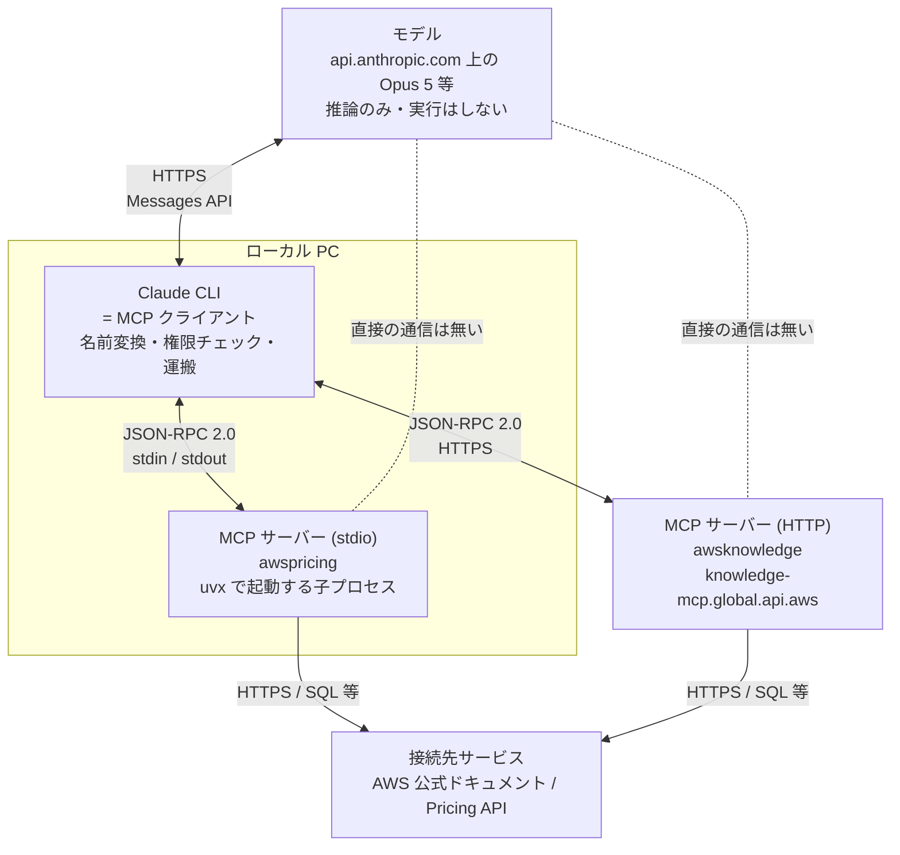
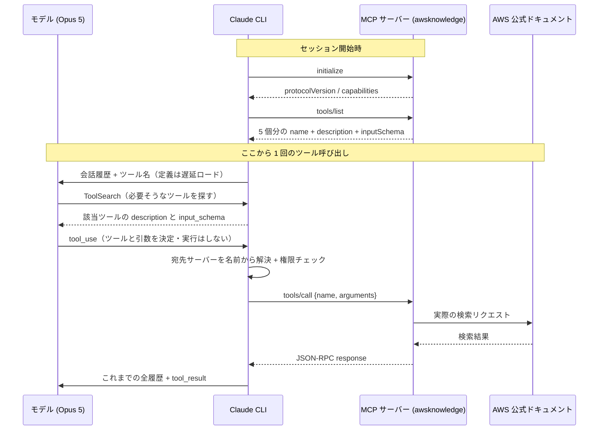

# MCP の仕組み — 誰が決め、誰が運ぶのか

MCP (Model Context Protocol) では、「どのツールを呼ぶか**決めている**主体」と「その処理を**実行している**主体」が別のプロセスにいる。ここを混ぜると仕組み全体が理解できなくなる。このノートでは 4 者（モデル / Claude CLI / MCP サーバー / 接続先サービス）の境界を先に固定し、その上で 1 回のツール呼び出しで何がどの経路を流れるかを追う。

- 公式: [Model Context Protocol](https://modelcontextprotocol.io/introduction)
- 公式: [MCP 仕様 — Tools](https://modelcontextprotocol.io/specification/2025-06-18/server/tools)（`tools/list`・`tools/call`・`listChanged` の規定）
- 公式: [Connect Claude Code to tools via MCP](https://code.claude.com/docs/en/mcp)

**用語**: 以降「モデル」とは `api.anthropic.com` 上で動く Opus 5 等の推論エンドポイントを指す。「クラウド」という語は、ローカル PC との対比が必要な箇所以外では使わない（このリポジトリでは AWS / GCP の意味でも「クラウド」を使うため）。

このノートの例はすべて、この開発環境で実際に登録されている MCP サーバー（`deploy-on-aws` プラグイン同梱の 3 つ）で確認した実物を使う。

---

## 全体像



図で一番重要なのは点線の 2 本。**モデルと MCP サーバーの間には、通信経路が 1 本も存在しない。** すべて Claude CLI を経由する。

図のとおり MCP サーバーは 2 形態あり、境界の位置が変わる。「ローカルかどうか」は本質ではなく、本質は「**Claude CLI が唯一のハブである**」こと。

---

## サーバーは 2 種類ある — ローカル型とリモート型

MCP サーバーは全部ローカルで動く、という理解になりやすいが、実際は 2 種類ある。MCP が公開された当初はリモートの仕様が無く stdio だけだったので、初期の資料を読むとそう見える。

分類の軸は **transport（CLI とサーバーの通信方式）**で、正確には 4 つある。ローカルが 1 つ、リモートが 3 つ。

| transport | 動く場所 | CLI との通信 | 状態 |
| --- | --- | --- | --- |
| `stdio` | **ローカル PC** の子プロセス | stdin / stdout（ポートも `localhost` も使わない単なるパイプ） | 現役 |
| `http`（別名 `streamable-http`） | リモート | HTTPS | **リモートの推奨** |
| `sse` | リモート | HTTPS (Server-Sent Events) | **非推奨**。SSE しか公開していないサービス向けに残っている |
| `ws`（WebSocket） | リモート | 常時接続の双方向 | 限定用途。OAuth 非対応（ヘッダ認証のみ）、`claude mcp add --transport` も受け付けない |

公式の位置づけは「HTTP servers are the recommended option for connecting to remote MCP servers. This is the most widely supported transport for cloud-based services」「The SSE (Server-Sent Events) transport is deprecated」。実際に使うのは `stdio` と `http` の 2 つと考えてよい。

### 主要なサーバーはリモート型が多い

公式ドキュメントが実名で挙げているサービスを数えると、**リモート 6 / ローカル 2** になる。

| サービス | transport | 種別 |
| --- | --- | --- |
| Notion, Stripe, HubSpot, Sentry, GitHub | `http` | リモート |
| Asana | `sse` | リモート |
| Airtable | `stdio` | ローカル（API キーを `--env` で渡す） |
| PostgreSQL (`@bytebase/dbhub`) | `stdio` | ローカル |

同じ傾向は 2 点で裏付けられる。

- **Anthropic Directory はリモート専用** — 公式の案内は「Browse reviewed connectors in the Anthropic Directory ... you can add any **remote** server listed there with `claude mcp add`」。審査済みコネクタとして並んでいるものはリモートである。
- **この開発環境も 8 / 10 がリモート** — 登録済み 10 個のうち、claude.ai コネクタ 7 個と `awsknowledge` がリモート、`awsiac` と `awspricing` だけが stdio。

理由は提供者側の都合で説明できる。SaaS にとっては、自社でエンドポイントをホストすれば実装を更新し続けられ、利用者に配布物を渡す必要がない。一方、**手元のリソースを触るもの**（DB、ローカルファイル、ローカルの CLI）は原理的にリモートから触れないので stdio になる。

| 触りたい対象 | 選ばれる形態 |
| --- | --- |
| SaaS のデータ（Notion, GitHub, Sentry 等） | リモート `http` |
| 手元の DB、ローカルファイル、ローカルコマンド | ローカル `stdio` |
| 公開情報の参照のみ（AWS 公式ドキュメント等） | リモート `http`（認証不要で済む） |

なお **リモートでも認証が不要な場合がある**。`awsknowledge` は公開情報を返すだけなので認証なしで接続できている。逆にローカル stdio でも外部 API を叩くなら API キーが必要になる。認証の要否を決めるのは「ローカルかリモートか」ではなく「**誰のデータを触るか**」である。

---

## 登場人物と責務

| 登場人物 | どこで動くか | 責務 | やらないこと |
| --- | --- | --- | --- |
| **モデル** (Opus 5 等) | Anthropic のサーバー | どのツールをどの引数で呼ぶか**決める** | 実行しない。MCP サーバーの存在も知らない |
| **Claude CLI** (= MCP クライアント) | ローカル PC | 一覧の取得、ツール名の変換、権限チェック、結果の**運搬** | どのツールを呼ぶかは**決めない** |
| **MCP サーバー** | ローカル子プロセス or リモート HTTP | 「何ができるか」の一覧を返す。渡された引数で**実処理**する | 何を呼ぶべきかは判断しない。Anthropic のことは何も知らない |
| **接続先サービス** | 外部 (GitHub, DB, AWS ドキュメント等) | データ源 | MCP を知らない。普通の HTTPS / DB プロトコルで叩かれるだけ |

1 行にまとめると **モデルが決めて、CLI が運び、MCP サーバーが実行する**。

よくある誤解は「CLI が一覧を見て実行を決めている」というもの。CLI は決めない。CLI がやるのは、一覧をモデルに見せること・モデルが出した指示を JSON-RPC に翻訳すること・危険なら止めること（権限チェック）である。

---

## MCP サーバーは何と通信しているのか

MCP サーバーが通信する相手は 2 つだけ。

- **上流: Claude CLI のみ** — stdio サーバーなら同一 PC の親プロセスと stdin/stdout で JSON-RPC を交換する。ネットワークを使わず、ポートも開かない。HTTP サーバーなら CLI からの HTTPS リクエストを受ける。
- **下流: 接続先サービス** — AWS 公式ドキュメントを検索する、GitHub API を叩く、DB に接続する。これはサーバーが独自にやっている通信で、MCP とは無関係。

`api.anthropic.com` への通信は CLI が一手に担っている。MCP サーバーに Anthropic の API キーは渡されない。

**セキュリティ上の意味**: サーバーの実行結果は、CLI がいったん受け取ってから次のリクエストのプロンプトに入れてモデルへ送る。DB のパスワードや API トークンはサーバーの環境変数に留まりモデルには渡らないが、サーバーが返した**中身**（クエリ結果など）は必然的にモデルのコンテキストに入る。ここは意識しておく必要がある。

---

## ツール一覧はどこから来るのか

MCP サーバーは「何ができるか」と「どう呼ぶか」の一覧を持っている。CLI はセッション開始時に `tools/list` でそれを取得する。返ってくるのは 3 点セット。

| フィールド | 中身 | 誰が読むか |
| --- | --- | --- |
| `name` | ツール名 | CLI（宛先解決）とモデル |
| `description` | いつ使うべきかの説明 | **モデル**（ここを読んで使うか決める） |
| `inputSchema` | 引数の JSON Schema（型・必須・既定値） | **モデル**（ここを読んで引数を組み立てる） |

`awsknowledge` に実際に問い合わせて返ってきた一覧（5 個のうち 1 個を抜粋、`description` は長いので省略）。

```json
{"jsonrpc":"2.0","id":2,"result":{"tools":[
  {
    "name": "aws___search_documentation",
    "description": "AWS docs search. Each result's `context` is verbatim page text ...",
    "inputSchema": {
      "type": "object",
      "properties": {
        "search_phrase": { "type": "string",  "description": "Keywords; preserve exact error strings ..." },
        "limit":         { "type": "integer", "description": "Maximum number of results to return (default 4)." },
        "topics":        { "type": "array", "items": {"type": "string"},
                           "description": "Up to 3 from: reference_documentation, troubleshooting, cdk_docs, ... Default [\"general\"]." }
      },
      "required": ["search_phrase"]
    }
  }
]}}
```

これが「AWS 公式ドキュメントを調べるなら `search_phrase` を必ず渡せ、`limit` と `topics` は任意」という**使い方の仕様書**そのもの。人間向けの README ではなく、モデルが読む機械可読な仕様として渡される。

CLI はこれを Anthropic API のツール定義形式に変換してモデルへ渡す。変換されるのは主に 2 点。

```json
{
  "name": "mcp__plugin_deploy-on-aws_awsknowledge__aws___search_documentation",
  "description": "AWS docs search. Each result's `context` is verbatim page text ...",
  "input_schema": { "...": "inputSchema と同じ内容" }
}
```

- **名前に名前空間が付く** — `mcp__<サーバー名>__<ツール名>`。プラグイン同梱のサーバーはさらに長く `mcp__plugin_<プラグイン名>_<サーバー名>__<ツール名>` になる（`A-Z a-z 0-9 _ -` 以外の文字は `_` に置換される）。この名前を使うのは権限ルール・スキルの `allowed-tools`・フックのマッチャーを書くときで、素のサーバー名で書いた `mcp__awsknowledge__.*` はプラグイン同梱サーバーには一致しない。
- **キーの命名が変わる** — MCP は `inputSchema`（camelCase）、Anthropic API は `input_schema`（snake_case）。

`tools/list` は起動時 1 回きりではない。サーバーが `notifications/tools/list_changed` 通知（`id` を持たない一方向のメッセージ）を送ると、Claude Code は `tools/list` を再度呼んで一覧を取り直す。

この通知を実装するかはサーバーの自由で、対応の有無は `initialize` の応答で申告される。`awsknowledge` の申告は `"capabilities":{"tools":{"listChanged":false}}`、つまり「ツールは提供するが、一覧が変わっても通知は送らない」。したがってこのサーバーの 5 個はセッション中に変わらないものとして扱われ、仮にサーバー側でツールが増えてもセッションを開き直すまで反映されない。逆に `listChanged: true` を申告するサーバーは接続後にツールが増減し得る（DB に接続してからテーブルごとのツールが生える、認証後に管理系ツールが増える、など）。

---

## 1 回のツール呼び出しで実際に流れるもの



要点を 4 つ。

1. **決定はモデル、実行は CLI 経由** — モデルが返すのは `tool_use` ブロック（`{"name": "mcp__...__aws___search_documentation", "input": {"search_phrase": "..."}}`）という JSON でしかない。モデルはここで止まる。
2. **ツール定義は既定で遅延ロードされる** — 公式に「Tool search keeps MCP context usage low by deferring tool definitions until Claude needs them. Only tool names and server instructions load at session start」とあり、これが既定動作。全スキーマが最初からコンテキストに載っているわけではない。`ENABLE_TOOL_SEARCH=false` で従来の一括ロードに、`auto` でコンテキストの 10% に収まる分だけ先読みする挙動に切り替わる。
3. **CLI が実際に投げるのは JSON-RPC** — stdio サーバーなら stdin へ 1 行で流れる。

   ```json
   {"jsonrpc":"2.0","id":7,"method":"tools/call","params":{"name":"aws___search_documentation","arguments":{"search_phrase":"ECS Service Connect"}}}
   ```

   ここで名前空間プレフィックスが外れている点に注目。名前空間は CLI とモデルの間だけの都合で、サーバーは自分の素のツール名しか知らない。
4. **毎回全履歴が送り直される** — モデルはステートレスなので、最後の `tool_result` は「会話履歴の続き」として全体と一緒に再送される。ツールを 1 回呼ぶごとに CLI ↔ モデルの往復が 1 回増える。

HTTP サーバーの場合、上図の `tools/list` と `tools/call` の経路が stdin/stdout ではなく HTTPS になるだけで、順序と役割分担は変わらない。

---

## 「インストール」で実際に何が入るのか

種類によって全く違う。この環境の設定（`deploy-on-aws` プラグインの `.mcp.json`）に両方揃っている。

**stdio サーバー** — 入るのは普通のプログラム。「標準入力から JSON-RPC を読んで標準出力に返す CLI ツール」でしかない。

```json
{ "type": "stdio", "command": "uvx", "args": ["awslabs.aws-pricing-mcp-server@latest"] }
```

これは「このコマンドを子プロセスとして起動しろ」というレシピにすぎない。`claude mcp add` 自体は**何もダウンロードしない**。設定ファイル（`~/.claude.json` か `.mcp.json`）に数行の JSON を書くだけで、パッケージ取得は `uvx` / `npx` が初回実行時に行い、プロセス起動は Claude Code のセッション開始時。だから公式にも「The `claude mcp add` command saves the configuration without validating credentials」とあり、プレースホルダーの資格情報でも受理され、後で接続失敗として現れる。

`command` が PATH に無ければ当然起動しない。この環境では `uvx` が未インストールのため、実際に次の状態になっている（`claude mcp list`）。

```
plugin:deploy-on-aws:awsiac:       uvx awslabs.aws-iac-mcp-server@latest      - ✘ Failed to connect — ENOENT: Executable not found in $PATH: "uvx"
plugin:deploy-on-aws:awspricing:   uvx awslabs.aws-pricing-mcp-server@latest  - ✘ Failed to connect — ENOENT: Executable not found in $PATH: "uvx"
plugin:deploy-on-aws:awsknowledge: https://knowledge-mcp.global.api.aws (HTTP) - ✔ Connected
```

重要なのは**常駐デーモンではない**という点。セッションごとに spawn され、セッションを閉じれば死ぬ。`systemctl` に登録するようなものではない。stdio サーバーが切断時に自動再接続されないのも、これがローカルプロセスだから（公式: 「Stdio servers are local processes and are not reconnected automatically」）。

**HTTP サーバー** — 何もインストールされない。登録されるのは URL だけ。

```json
{ "type": "http", "url": "https://knowledge-mcp.global.api.aws" }
```

図の「ローカル PC」の枠の外に MCP サーバーが置かれる形になる。切断時は指数バックオフで自動再接続される（1 秒から倍々で最大 5 回。5 回失敗すると failed 扱いになり `/mcp` から手動で再試行できる）。

認証が必要なサーバーは OAuth 2.0 で、トークンは公式によれば「your system keychain (macOS) or a credentials file」に保存される。macOS 以外は後者で、この環境（WSL2 / Linux）には `~/.claude/.credentials.json`（パーミッション 600）がある。削除は `claude mcp logout <サーバー名>`。

---

## この構造から導かれる実践的な帰結

**サーバーのデバッグは Claude なしで完結する** — JSON-RPC を手で投げればよい。HTTP サーバーなら `curl` で確認できる。ただし `initialize` → 返ってきた `mcp-session-id` を付けて `tools/list`、という順序が必要で、単発で `tools/list` だけ投げても通らない。

```bash
# 1) セッションを開く。mcp-session-id はレスポンスヘッダで返る
curl -sS -D - -X POST https://knowledge-mcp.global.api.aws \
  -H 'Content-Type: application/json' \
  -H 'Accept: application/json, text/event-stream' \
  -d '{"jsonrpc":"2.0","id":1,"method":"initialize","params":{"protocolVersion":"2025-06-18","capabilities":{},"clientInfo":{"name":"manual","version":"0.1"}}}'

# 2) 受け取った ID を付けてツール一覧を取る
curl -sS -X POST https://knowledge-mcp.global.api.aws \
  -H 'Content-Type: application/json' \
  -H 'Accept: application/json, text/event-stream' \
  -H 'mcp-session-id: <1 で返った値>' \
  -d '{"jsonrpc":"2.0","id":2,"method":"tools/list"}'
```

1 の応答では、こちらが要求した `2025-06-18` に対しサーバーが `2025-03-26` を返してくる。プロトコルバージョンはネゴシエーションされる。stdio サーバーなら同じ順序の JSON-RPC を stdin に流せば同じことができる。

**サーバーの標準出力は聖域** — stdio サーバーの stdout は JSON-RPC 専用チャンネル。`console.log` でデバッグ出力を書くとプロトコルが壊れる。ログは必ず stderr へ。自作サーバーで最も多いバグ。

**`description` の書き方がそのまま精度になる** — ツールを選ぶのはモデルであり、その判断材料は `description` と `inputSchema` だけ。`awsknowledge` の `description` が「Pick ONE topic. Add a 2nd ONLY if query genuinely spans domains.」のように使い方の指示まで書き込んでいるのは、それがモデルへのプロンプトとして機能するから。

**モデルを変えてもサーバーは無関係** — Opus 5 から Sonnet 5 に切り替えても MCP サーバー側は何も変わらない。境界が分かれているため。
