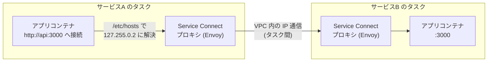
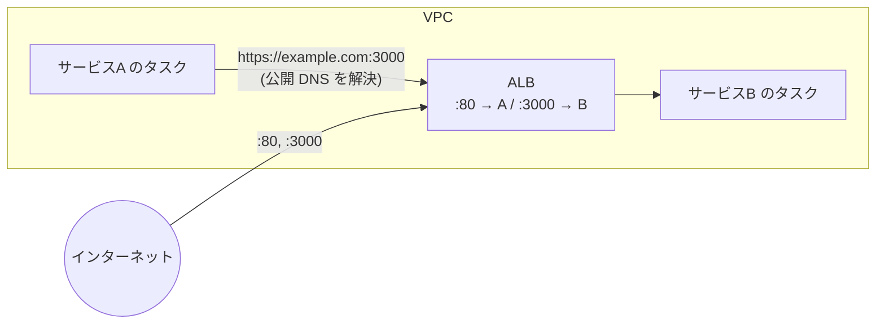
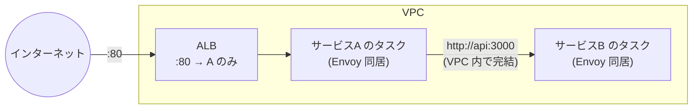

# ECS Service Connect — サービス間通信の仕組みと選択肢

ECS における「コンテナ間 / タスク間 / サービス間」の通信の違いを整理し、サービス間通信を担う Service Connect の仕組み、ALB 経由との比較、Cloud Map（サービスディスカバリ）との違い、その他の通信手段をまとめる。最後にこのリポジトリの構成ではどうなっているかを確認する。

- 公式: [Amazon ECS サービス間の相互接続](https://docs.aws.amazon.com/AmazonECS/latest/developerguide/interconnecting-services.html)
- 公式: [Amazon ECS Service Connect](https://docs.aws.amazon.com/AmazonECS/latest/developerguide/service-connect.html)

---

## 1. まず用語の整理: コンテナ間 / タスク間 / サービス間

「サービス間通信」は通信の物理経路の分類ではなく、**名前解決と負荷分散をサービス単位の抽象で扱う仕組み**を指す。3 層を分けると次のようになる。

| 層 | 通信の相手 | 経路の実体 | このリポでの例 |
| --- | --- | --- | --- |
| コンテナ間（同一タスク内） | 同じタスク内の別コンテナ | `localhost`（awsvpc モードではタスク内の全コンテナがネットワーク名前空間を共有） | nginx → PHP-FPM（`fastcgi_pass 127.0.0.1:9000`） |
| タスク間 | 別タスクの ENI | VPC 内の IP 通信（宛先 IP を何らかの方法で知る必要がある） | なし |
| サービス間 | 「サービス名」で指した相手 | 実体はタスク間通信。その上に名前解決・負荷分散・ヘルスチェックの層が乗る | なし（SQS 経由の非同期通信で代替。§7 参照） |

つまり **Service Connect は「サービス間通信の仕組み」だが、流れるパケット自体はタスク間の IP 通信**である。Service Connect が付け足すのは「宛先タスクをサービス名から見つけ、複数タスクに分散し、失敗時にリトライする」という部分になる。

### このリポで見られる実例: 同じ nginx 設定でも名前解決が違う

| 環境 | 設定ファイル | fastcgi_pass の宛先 | 名前解決の方法 |
| --- | --- | --- | --- |
| ローカル (docker compose) | `environment/nginx.conf` | `laravel:9000` | Docker の内蔵 DNS がコンテナ名を解決（コンテナ間だが**別コンテナ・別ネットワーク名前空間**） |
| ECS (awsvpc) | `environment/ecr/nginx.conf` | `127.0.0.1:9000` | 名前解決不要。同一タスク内でネットワーク名前空間を共有しているため localhost で届く |

同じ「nginx → PHP-FPM」でも、コンテナの同居のさせ方によって宛先の書き方が変わる。ECS の awsvpc モードでは「同一タスク内 = localhost」が成り立つ。

- 公式: [Fargate タスクネットワーキング](https://docs.aws.amazon.com/AmazonECS/latest/developerguide/fargate-task-networking.html)

---

## 2. Service Connect とは

**ECS サービスに「サービス名で呼び出せる内部エンドポイント」を持たせる機能。** 各タスクに Envoy ベースのプロキシコンテナ（`ecs-service-connect-agent`）がサイドカーとして自動注入され、通信はすべてこのプロキシを経由する。

### 名前解決の実体

`http://api:3000` のような名前は Route 53 の DNS レコードではない。仕組みは次の通り。

1. Service Connect エージェントが、タスク内アプリコンテナの `/etc/hosts` にエイリアスを書き込む（例: `api → 127.255.0.2`。`127.255.0.0/16` のループバック範囲が使われる）
2. アプリが `http://api:3000` に接続すると、その接続は**自タスク内の Envoy プロキシ**が受ける
3. Envoy が Cloud Map 名前空間（§4）から取得した最新の宛先タスク一覧をもとに、健全なタスクの ENI へ転送する



### プロキシが肩代わりしてくれること

| 機能 | 内容 |
| --- | --- |
| 負荷分散 | 接続単位で宛先タスクへ分散。DNS キャッシュに依存しない |
| ヘルスチェック連動 | 不健全なタスク・停止中のタスクを宛先から自動的に外す（アウトライア検出） |
| リトライ | 一時的な失敗を自動でリトライ。アプリ側の実装が不要 |
| メトリクス | リクエスト数・エラー数・レイテンシを CloudWatch に自動送信 |
| タイムアウト | アイドル / リクエスト単位のタイムアウトをサービス側で設定可能 |

### コスト

Service Connect 自体に追加料金はない。ただしプロキシコンテナがタスクの CPU / メモリを消費するため、タスクサイズに余裕を持たせる必要がある（目安として最低 256 CPU ユニット・64 MiB がプロキシ用に必要）。

- 公式: [Service Connect の概念](https://docs.aws.amazon.com/AmazonECS/latest/developerguide/service-connect-concepts.html)

---

## 3. ALB 経由 vs Service Connect（ポート 80 / 3000 の例）

「ALB がポート 80 をサービス A に、ポート 3000 をサービス B に転送している」構成で、A から B を呼ぶ場合を比較する。

### before: ALB を折り返す

Service Connect がないと、A は B の宛先を知る手段がないため、公開エンドポイント `https://example.com:3000` を呼ぶことになる。



VPC 内から VPC 内への通信が、いったん ALB（公開リスナー）まで出て折り返す。この方式の問題点は 3 つ。

| 観点 | 問題 |
| --- | --- |
| コスト | 内部通信にも ALB の LCU 料金がかかる。タスクがプライベートサブネットにあり ALB の解決先がパブリック IP の場合、NAT Gateway の処理料金（ap-northeast-1 で $0.062/GB）も乗る |
| セキュリティ | 内部通信のためだけにポート 3000 のパブリックリスナーを公開し続ける必要がある。B のセキュリティグループも「ALB からの受信」を許可する形になり、「誰が B を呼べるか」を絞りにくい |
| レイテンシ・可用性 | ホップが増える（A → ALB → B）。ALB のリスナールール評価も毎回通る |

### after: Service Connect で直接届く



- A は `http://api:3000` を呼ぶだけで、通信は VPC 内のタスク間 IP 通信で完結する
- ポート 3000 のパブリックリスナーは不要になり、**ALB は「外部からの入口」の役割に専念**できる
- ALB と Service Connect は排他ではない。「外向きは ALB、サービス間は Service Connect」の併用が標準的な構成

つまり冒頭の問いへの回答は **Yes** — `https://example.com:3000` として ALB を経由させる必要がなくなる。

---

## 4. Cloud Map とは何か / Service Connect との関係

**AWS Cloud Map は「サービス名 → 接続先（IP・ポート）」の対応を登録・検索できるサービスレジストリ。** ECS はタスクの起動・停止に合わせて Cloud Map への登録・削除を自動で行える。

- 公式: [AWS Cloud Map とは](https://docs.aws.amazon.com/cloud-map/latest/dg/what-is-cloud-map.html)

ECS には Cloud Map を使う統合が 2 つあり、名前が紛らわしいので注意する。

1. **サービスディスカバリ（Service Discovery）**: Cloud Map の DNS 名前空間（Route 53 プライベートホストゾーン）にタスク IP を登録し、クライアントは通常の **DNS 解決**で宛先 IP を得て直接つなぐ。プロキシなし。
2. **Service Connect**: Cloud Map の名前空間を**レジストリとして内部利用**するが、クライアントは DNS を引かない。Envoy プロキシが宛先一覧を Cloud Map から取得して転送する。

| | サービスディスカバリ | Service Connect |
| --- | --- | --- |
| 名前解決 | DNS（`api.internal.local` → タスク IP） | `/etc/hosts` のエイリアス → Envoy が転送 |
| 通信経路 | クライアント → 宛先タスクへ直接 | クライアント → 自タスクの Envoy → 宛先タスク |
| 負荷分散 | DNS ラウンドロビンのみ。クライアントの DNS キャッシュに依存 | Envoy が接続単位で分散 |
| デプロイ・スケールイン時 | **DNS キャッシュに古いタスク IP が残り、接続エラーが起きうる**（TTL 依存） | プロキシが宛先をリアルタイムに更新するため起きにくい |
| リトライ / タイムアウト | なし（アプリで実装） | プロキシが自動処理 |
| メトリクス | なし | CloudWatch に自動送信 |
| 追加リソース | なし | タスクごとにプロキシ分の CPU / メモリ |

**Service Connect は Cloud Map を土台に、DNS 方式の弱点（キャッシュ・分散・リトライなし）をプロキシで解決した上位版**と整理できる。新規にサービス間通信を組むなら、AWS も Service Connect を推奨している。

- 公式: [サービスディスカバリ](https://docs.aws.amazon.com/AmazonECS/latest/developerguide/service-discovery.html)

---

## 5. サービス間通信の選択肢の全体像

| 方式 | 名前解決 | 負荷分散 | 主な用途 | 追加コスト |
| --- | --- | --- | --- | --- |
| 内部 ALB / NLB | LB の DNS 名 | LB が実施（L7 / L4） | パスルーティングが必要、ECS 以外（EC2 / Lambda）も混在する場合 | LB の時間料金 + LCU |
| サービスディスカバリ (Cloud Map DNS) | DNS | DNS ラウンドロビンのみ | プロキシのオーバーヘッドを避けたい、gRPC 等で自前のクライアントサイド LB がある場合 | なし |
| Service Connect | `/etc/hosts` + Envoy | Envoy が接続単位で実施 | ECS サービス間の同期通信の第一候補 | プロキシ分の CPU / メモリ |
| 非同期（SQS / SNS / EventBridge） | 不要（キュー / トピックの URL） | コンシューマ側のスケールで調整 | 即時応答が不要な処理。呼び出し側と受け側を時間的に分離できる | キューのリクエスト料金 |

### 参考: 選ばない・特殊用途の選択肢

- **App Mesh**: Envoy を使うサービスメッシュだが、**2026 年 9 月 30 日でサービス終了**。AWS は Service Connect への移行を案内している。新規採用はしない。([移行ガイド](https://aws.amazon.com/blogs/containers/migrating-from-aws-app-mesh-to-amazon-ecs-service-connect/))
- **VPC Lattice**: VPC・アカウントをまたいでサービス網を組むためのサービス。単一 VPC 内の ECS サービス間なら Service Connect で足りる。([公式](https://docs.aws.amazon.com/vpc-lattice/latest/ug/what-is-vpc-lattice.html))

### 同期 vs 非同期という軸

上 3 つ（内部 LB / サービスディスカバリ / Service Connect)は「A が B の応答を待つ」**同期通信**の実現方法の違いにすぎない。それに対して SQS 等の非同期通信は「A は投げたら先へ進み、B は都合の良いときに処理する」という**結合の仕方自体が違う**選択肢。B が一時的に落ちていてもメッセージは失われない、B の処理速度に合わせてスケールできる、という性質は同期通信では得られない。

---

## 6. Terraform での最小設定例

§3 の after 構成（A が client、B が呼ばれる側）を Terraform に落とすと、必要な要素は 3 つ。

### (1) 名前空間（クラスタに関連付け）

```hcl
resource "aws_service_discovery_http_namespace" "main" {
  name = "internal"
}

resource "aws_ecs_cluster" "main" {
  name = "example-cluster"

  service_connect_defaults {
    namespace = aws_service_discovery_http_namespace.main.arn
  }
}
```

DNS 名前空間ではなく **HTTP 名前空間**で良い点に注意。Service Connect は DNS を引かないため、Route 53 ホストゾーンが作られない安価な HTTP 名前空間で足りる。

### (2) タスク定義: portMappings に「名前」を付ける

```hcl
# サービスB のタスク定義（container_definitions 内）
portMappings = [
  {
    name          = "api"        # ← このポート名が Service Connect で公開する単位になる
    containerPort = 3000
    appProtocol   = "http"       # L7 メトリクス・リトライを有効にする
  }
]
```

### (3) サービス側: service_connect_configuration

**呼ばれる側（B）と呼ぶだけの側（A）で設定が非対称**になる。ここが Service Connect 設定の一番の要点。

```hcl
# サービスB: クライアントサーバーモード（呼ばれる側。エンドポイントを公開する）
resource "aws_ecs_service" "b" {
  # ...
  service_connect_configuration {
    enabled = true

    service {
      port_name      = "api"     # タスク定義の portMappings.name と一致させる
      discovery_name = "api"
      client_alias {
        port     = 3000
        dns_name = "api"         # 他サービスから http://api:3000 で呼べる名前
      }
    }
  }
}

# サービスA: クライアントモード（呼ぶだけ。service ブロックを持たない）
resource "aws_ecs_service" "a" {
  # ...
  load_balancer {                # 外向きの ALB はそのまま併用できる
    container_name = "nginx-container"
    container_port = 80
    # ...
  }

  service_connect_configuration {
    enabled = true               # 同じ名前空間に参加するだけで api を解決できるようになる
  }
}
```

| モード | service ブロック | 意味 |
| --- | --- | --- |
| クライアントサーバーモード | あり | エンドポイントを名前空間に公開し、かつ他サービスも呼べる（B） |
| クライアントモード | なし | 名前空間内の名前を解決して呼ぶだけ。自分は公開しない（A） |

どちらのモードでもプロキシは注入される。また A に `load_balancer` ブロックが残っている通り、**ALB（外向き）と Service Connect（内向き）は同一サービスで併用できる**。

- Terraform: [aws_ecs_service — service_connect_configuration](https://registry.terraform.io/providers/hashicorp/aws/latest/docs/resources/ecs_service#service_connect_configuration-1)

---

## 7. このリポジトリではどうなっているか

このリポの stg 環境（`terraform/modules/app-infrastructure/`）の ECS サービスは 2 つ。

| サービス | 定義 | 受信ポート | 通信 |
| --- | --- | --- | --- |
| web (`*-main-service`) | `ecs_web.tf` | nginx :80（ALB から） | タスク内: nginx → PHP-FPM は `127.0.0.1:9000`（コンテナ間） |
| queue (`*-queue-service`) | `ecs_queue.tf` | なし | SQS をポーリングして処理（非同期） |

Service Connect を使っていない理由は、**同期的なサービス間通信がそもそも存在しない**ため。

- web → queue の連携は「web が SQS にメッセージを送り、queue ワーカーが取り出す」**非同期通信**（§5 の 4 行目の方式）。queue サービスは受信ポートすら持たない
- web タスク内の nginx → PHP-FPM は同一タスク内の**コンテナ間通信**（localhost）で、サービス間ですらない

将来、たとえば「バックエンド API とは別の内部マイクロサービス（認証、レコメンド等）を web から同期的に呼ぶ」構成になったとき、初めて §5 の同期 3 方式から選ぶことになり、その第一候補が Service Connect になる。

---

## 参考リンク

- [Amazon ECS サービス間の相互接続（方式比較の公式ページ）](https://docs.aws.amazon.com/AmazonECS/latest/developerguide/interconnecting-services.html)
- [Amazon ECS Service Connect](https://docs.aws.amazon.com/AmazonECS/latest/developerguide/service-connect.html)
- [Service Connect の概念（プロキシ・127.255.0.0/16 の説明）](https://docs.aws.amazon.com/AmazonECS/latest/developerguide/service-connect-concepts.html)
- [サービスディスカバリ（Cloud Map DNS 方式）](https://docs.aws.amazon.com/AmazonECS/latest/developerguide/service-discovery.html)
- [AWS Cloud Map とは](https://docs.aws.amazon.com/cloud-map/latest/dg/what-is-cloud-map.html)
- [App Mesh から Service Connect への移行（App Mesh は 2026-09-30 終了）](https://aws.amazon.com/blogs/containers/migrating-from-aws-app-mesh-to-amazon-ecs-service-connect/)
- [Terraform aws_ecs_service リソース](https://registry.terraform.io/providers/hashicorp/aws/latest/docs/resources/ecs_service)
