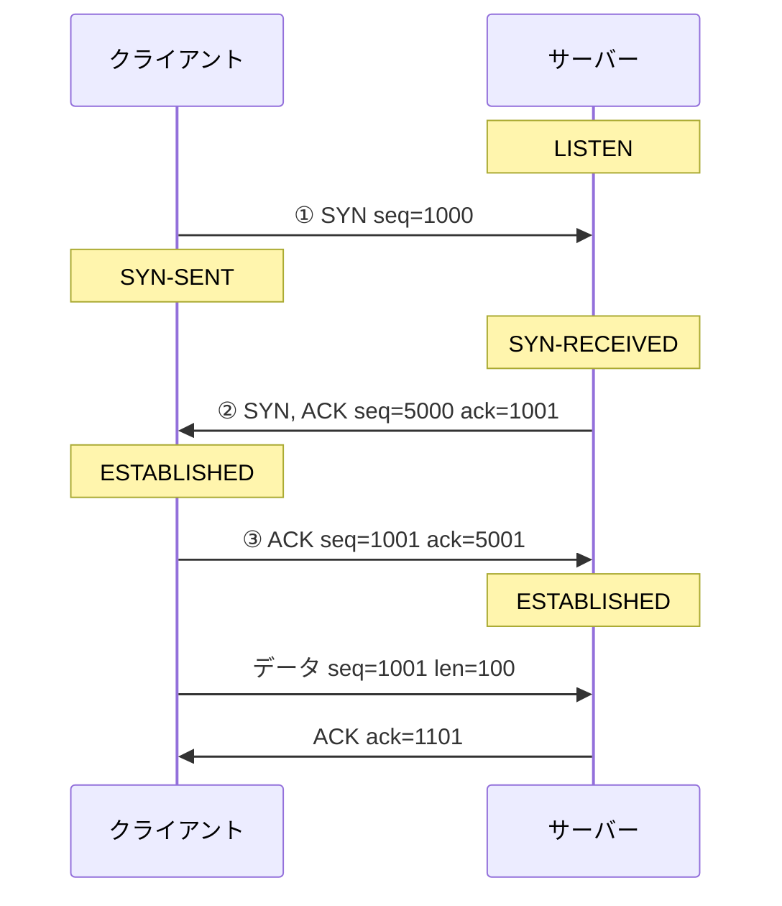
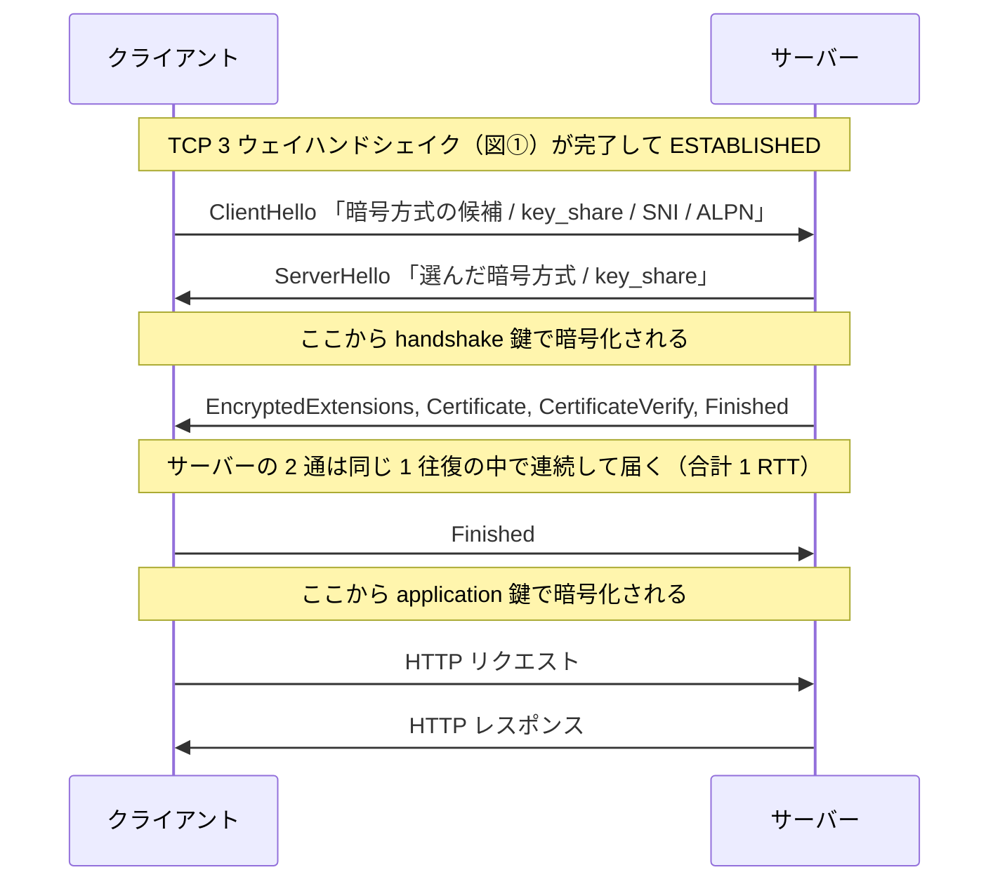
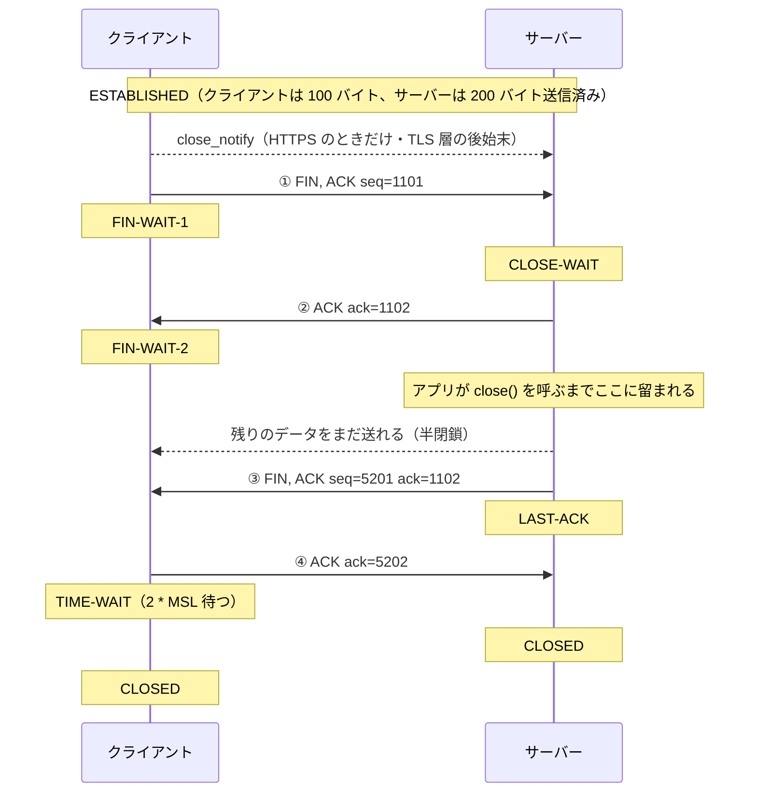

# TCP の接続と切断 — HTTPS では何が上に乗るのか

このノートは 3 つの問いに答える。

1. 接続を張るとき、なぜ 3 往復ではなく 3 回で足りるのか。そこで何が合意されるのか。
2. HTTPS になると何が増えるのか。経路上の第三者に何が見えて、何が見えないのか。
3. 接続を閉じるとき、なぜ 4 回かかるのか。なぜ片側だけが最後に待たされるのか。

- 公式: [RFC 9293 — Transmission Control Protocol (TCP)](https://www.rfc-editor.org/rfc/rfc9293.html)（RFC 793 以降の改訂を統合した現行版。状態遷移とオプションの規定）
- 公式: [RFC 8446 — TLS 1.3](https://www.rfc-editor.org/rfc/rfc8446.html)
- 公式: [RFC 5246 — TLS 1.2](https://www.rfc-editor.org/rfc/rfc5246.html)（RFC 8446 により廃止扱いだが 1.2 自体は現役）
- 公式: [RFC 9112 — HTTP/1.1](https://www.rfc-editor.org/rfc/rfc9112.html#section-9)（持続接続 = keep-alive の規定）
- 公式: [RFC 6528 — Defending against Sequence Number Attacks](https://www.rfc-editor.org/rfc/rfc6528.html)（ISN の生成方法）
- 公式: [RFC 4987 — TCP SYN Flooding Attacks and Common Mitigations](https://www.rfc-editor.org/rfc/rfc4987.html)

**表記**: 以降、TCP が 1 回で送る単位を「セグメント」と呼ぶ。「パケット」は IP 層の単位なので使い分ける。状態名は RFC 9293 の表記（`ESTABLISHED`、`FIN-WAIT-1` など）に揃える。Linux の `ss` コマンドは一部を短く表示する（`SYN-RECEIVED` → `SYN-RECV`、`ESTABLISHED` → `ESTAB`）。

図中の `seq` / `ack` は説明用の小さい値を使う。実際の初期値は 32 ビットの乱数で、その理由は後述する。

---

## 1. 接続を張る — 3 ウェイハンドシェイク

データを送る前に、「相手が生きていて受け取る気があるか」と「シーケンス番号をどこから数え始めるか」を互いに確認する。

### なぜ 3 回で足りるのか

必要な合意は「クライアント → サーバー方向の準備」と「サーバー → クライアント方向の準備」の 2 つで、単純に考えれば 2 往復 = 4 回になる。②のセグメントが **サーバーからの応答（ACK）とサーバー側からの接続要求（SYN）を 1 つにまとめている** ため 3 回で済む。SYN と ACK は同じヘッダの別のフラグなので、同時に立てられる。

### ack は「次に期待する seq」

`ack` は「ここまで受け取った」ではなく「**次はこの番号から送ってくれ**」を意味する。だから受け取った `seq` より大きい値が入る。

①で `seq=1000` を送ったのに②の `ack` が `1001` なのは、**SYN フラグ自体が 1 バイト分のシーケンス番号を消費する**ため。データが 0 バイトでも番号が 1 進む。図の最後にある「データ seq=1001 len=100」に対して `ack=1101` が返るのはこれと同じ計算で、こちらは実データ 100 バイト分進んでいる。後で見る FIN も同じく 1 消費する。

### ISN（初期シーケンス番号）が乱数である理由

`seq` の始まりを 0 に固定せず、接続ごとに乱数から始める。理由は 2 つある。

1. **古い接続の生き残りパケットを新しい接続に混入させない** — 同じ IP・ポートの組み合わせで接続を張り直したとき、ネットワークに漂っていた前の接続のセグメントが届くことがある。番号の範囲が毎回違えば、それは範囲外として捨てられる。
2. **経路上の第三者に `seq` を推測させない** — TCP は「番号が合っていれば正しい相手」として扱う。番号が予測できると、接続に割り込んで偽のデータを注入したり、RST を送って切断させたりできる。RFC 6528 はこの攻撃を防ぐため、接続の 4 つ組（送信元/宛先の IP とポート）と秘密鍵をハッシュした値を ISN に混ぜる方式を規定している。

### SYN で交換されるのは番号だけではない

SYN セグメントには TCP オプションが載り、この 1 往復で通信条件も決まってしまう。

| オプション | 何を決めるか | 決まらなかった場合 |
| --- | --- | --- |
| MSS (Maximum Segment Size) | 1 セグメントに載せる最大データ量。Ethernet 経由なら通常 1460 バイト | IPv4 では 536 バイトを仮定する（RFC 9293）。小さすぎて効率が落ちる |
| ウィンドウスケール | 受信ウィンドウの倍率。TCP ヘッダのウィンドウ欄は 16 ビット = 最大 64KB しか表せないため、倍率を掛けて広げる（RFC 7323） | 64KB 上限のまま。帯域が太く遅延が大きい経路で速度が出ない |
| SACK 許可 | 途中の 1 セグメントだけ欠けたとき、欠けた部分だけを再送させられるか | 欠けた箇所以降をまとめて再送することになる |
| タイムスタンプ | 往復時間の測定と、古いセグメントの識別 | 往復時間の推定精度が落ちる |

**ここが重要**: これらは接続確立時にしかネゴシエーションされない。片側が対応していなければ、その接続は最後までその条件で動く。

### この設計の弱点 — SYN flood と SYN cookie

②を返してから③を待つ間、サーバーは `SYN-RECEIVED` の接続を覚えておく必要がある。ここに攻撃の余地がある。

- **SYN flood** — 送信元 IP を偽装した SYN を大量に送り、③を返さない。サーバーは `SYN-RECEIVED` の待ち行列（backlog）を埋め尽くされ、正規の接続を受け付けられなくなる。
- **SYN cookie** — 緩和策。サーバーは状態を保存する代わりに、接続の 4 つ組などを秘密鍵でハッシュした値を②の `seq`（ISN）に埋め込んで送る。③の `ack` はその値 +1 で返ってくるので、**計算し直せば正しい相手だと検証できる**。状態を持たずに済むため待ち行列が溢れない。代償として、上の表のオプションを完全には保持できない（ISN の 32 ビットに詰め込める情報量に限りがあるため）。詳細は RFC 4987。

Linux では `net.ipv4.tcp_syncookies` で制御され、既定では「backlog が溢れたときだけ発動する」設定になっている。

---

## 2. HTTPS のとき何が増えるのか — TLS ハンドシェイク

### HTTPS は新しいプロトコルではない

`https` は「TCP の上に TLS という層を挟み、その中でいつもと同じ HTTP を流す」という構成を指すスキーム名で、定義は [RFC 9110 §4.2.2](https://www.rfc-editor.org/rfc/rfc9110.html#section-4.2.2) にある。HTTP のメソッドやヘッダの文法は何も変わらない。

| 層 | HTTP のとき | HTTPS のとき |
| --- | --- | --- |
| アプリケーション | HTTP | HTTP（同じもの） |
| — | （なし） | **TLS** |
| トランスポート | TCP | TCP（同じもの） |
| 既定ポート | 80 | 443 |

したがって前節の 3 ウェイハンドシェイクは HTTP と HTTPS で**完全に同一**。TLS はその後に始まる。

### TLS 1.3 の流れ

### 鍵素材の交換 — 鍵そのものは流れない

ClientHello / ServerHello に載る `key_share` は鍵ではなく、**Diffie-Hellman 鍵交換の公開値**。両者がそれを受け取って手元で計算すると、同じ共有秘密に到達する。共有秘密自体はネットワークを一度も流れないので、全パケットを記録されても鍵は復元できない。

### 証明書は暗号化のためではない

暗号化は上記の鍵交換で成立している。証明書が担うのは「**通信相手が本当にそのドメインの持ち主か**」の確認で、認証局 (CA) の署名を辿って検証する。ここが失敗したときにブラウザが警告を出すのは、「暗号化されていない」からではなく「**暗号化された相手が誰か分からない**」から。

`CertificateVerify` は、サーバーがその証明書に対応する秘密鍵を実際に持っていることの証明（ハンドシェイクの内容に署名したもの）。証明書だけならコピーできてしまうので、この 1 通が必要になる。

### 経路上の第三者に何が見えるか

暗号化が始まる境界は「ServerHello の直後」。ここを意識すると、何が隠れて何が隠れないかが正確になる。

| メッセージ | 経路上で読めるか | 中身 |
| --- | --- | --- |
| ClientHello | **読める** | 暗号方式の候補、`key_share`、**SNI**、**ALPN** |
| ServerHello | **読める** | 選ばれた暗号方式、`key_share` |
| EncryptedExtensions / Certificate / CertificateVerify / Finished（サーバー） | 読めない | 証明書もここに含まれる |
| Finished（クライアント） | 読めない | — |
| HTTP リクエスト / レスポンス | 読めない | URL のパス、ヘッダ、Cookie、ボディすべて |

平文で流れる 2 つは覚えておく価値がある。

- **SNI (Server Name Indication)** — 接続先のホスト名。1 つの IP で複数ドメインをホストしている場合、サーバーはどの証明書を出すべきか判断できないと困るため、暗号化の前に平文で伝える必要がある。結果として、**どのサイトに接続したかは経路上から分かる**（URL のパス以降は分からない）。
- **ALPN (Application-Layer Protocol Negotiation)** — TLS の中で流すプロトコルの取り決め。`h2`（HTTP/2）や `http/1.1` の候補を送り、サーバーが 1 つ選ぶ。HTTP/2 を使うかどうかがここで決まるので、**TLS ハンドシェイクが終わった時点で HTTP のバージョンも確定している**。

なお TLS 1.2 では `Certificate` が平文で流れるため、経路上からサーバー証明書が見えた。1.3 でこれが暗号化された。

### TLS 1.2 との違い

1.2 では ServerHello の後に `ClientKeyExchange` などのためにもう 1 往復必要だった。1.3 は鍵素材を最初の Hello に相乗りさせることで 1 往復に短縮した。

| | TLS 1.2 | TLS 1.3 |
| --- | --- | --- |
| TLS ハンドシェイク | 2 RTT | **1 RTT** |
| TCP 3 ウェイと合わせて データが流れ始めるまで | 3 RTT | **2 RTT** |
| 証明書は経路上から見えるか | 見える | 見えない |
| 鍵素材の送信 | ServerHello の後（別メッセージ） | ClientHello / ServerHello に同梱 |

往復 1 回の差は、遅延の大きい経路（モバイル回線や地理的に遠いサーバー）では体感できるほど効く。

---

## 3. 接続はいつまで生きているのか — keep-alive

レスポンスを返した直後に切断されるわけではない。HTTP/1.1 では**持続接続（keep-alive）が既定**で、1 本の TCP 接続を複数のリクエストで使い回す（[RFC 9112 §9](https://www.rfc-editor.org/rfc/rfc9112.html#section-9)）。

- 前節までの 3 ウェイハンドシェイクや TLS ハンドシェイクは、**接続を張るときに 1 回だけ**。ページ内の画像やAPI呼び出しごとに繰り返すわけではない。
- 閉じたいときは `Connection: close` ヘッダで宣言する。HTTP/1.0 は逆に、維持したい側が `Connection: keep-alive` を明示する必要があった。
- HTTP/2 ではさらに、1 本の接続の中で複数のリクエストを並行して流す（多重化）。接続を張るコストの比重はより小さくなる。

実際に接続が閉じるのは、**どちらかがアイドルタイムアウトに達したとき**か、**アプリケーションが明示的に閉じたとき**。ここで実務上の落とし穴が 1 つある。

**閉じるタイミングの競合** — サーバーがアイドルタイムアウトで FIN を送ったのと同時に、クライアントが「まだ生きている」と思って次のリクエストを送ってしまうことがある。このリクエストは届かないので、クライアント側で接続を張り直して再送する必要がある。RFC 9112 の「Retrying Requests」がこの再試行を規定しているのはこのため。

次節の切断は、この keep-alive が終わった後に起きることだと理解して読む。

---

## 4. 接続を閉じる — FIN による 4 ウェイ

### なぜ 4 回か — 半閉鎖（half-close）

**TCP の接続は、送る方向と受ける方向が独立している。** FIN は「自分はもう送るものがない」の宣言でしかなく、相手の送信を止める効果はない。

だから閉じる手順は「クライアント → サーバー方向を閉じる（①②）」と「サーバー → クライアント方向を閉じる（③④）」の 2 段階になる。この片方だけ閉じた状態が**半閉鎖**で、図の `FIN-WAIT-2` / `CLOSE-WAIT` の区間がそれにあたる。ここでサーバーはまだデータを送れる。

接続確立の②が SYN と ACK を 1 つにまとめられたのに対し、切断では②と③をまとめられないのがこの非対称性の理由。②はカーネルが即座に返すが、③は**アプリケーションが `close()` を呼ぶまで送られない**。「まだ書き終わっていない処理」がありうるので、カーネルが勝手に③を送るわけにいかない。

ただし、アプリが即座に閉じる場合は②と③が 1 つのセグメントに合わさり、結果的に 3 回で終わることもある。「必ず 4 回」ではなく「**論理的に 4 段階必要で、まとめられるとは限らない**」が正確。

### 状態の意味

| 状態 | どちら側 | 意味 | ここで止まっていたら |
| --- | --- | --- | --- |
| `FIN-WAIT-1` | 先に閉じた側 | FIN を送り、その ACK を待っている | 相手に届いていない、または相手が応答不能 |
| `FIN-WAIT-2` | 先に閉じた側 | 自分の FIN は受理された。相手の FIN を待っている | 相手のアプリが `close()` を呼んでいない |
| `CLOSE-WAIT` | 後から閉じる側 | 相手の FIN を受理した。自分が閉じる番 | **自分のアプリが `close()` を呼んでいない**（ソケットリークの典型的な症状） |
| `LAST-ACK` | 後から閉じる側 | FIN を送り、最後の ACK を待っている | 最後の ACK が届いていない |
| `TIME-WAIT` | 先に閉じた側 | 全部終わったが、念のため待っている | 正常。下記参照 |

`CLOSE-WAIT` が大量に積まれている場合、原因はネットワークではなく**自分のコード**（接続を閉じ忘れている）である可能性が高い。

### なぜ能動クローズ側だけ待つのか — TIME-WAIT

④の ACK を送った側だけが、すぐ `CLOSED` にならず **2 * MSL** 待つ。MSL (Maximum Segment Lifetime) は「セグメントがネットワークに存在しうる最大時間」で、RFC 9293 は 2 分を推奨値としている（したがって `TIME-WAIT` は 4 分）。理由は 2 つ。

1. **最後の ACK が失われた場合に備える** — ④が届かなければ、相手は `LAST-ACK` のまま③の FIN を再送してくる。すでに `CLOSED` になっていると、FIN に対して RST を返してしまい、相手側にエラーとして記録される。`TIME-WAIT` に留まっていれば ACK を返し直せる。
2. **古いセグメントが新しい接続に混ざらないようにする** — 同じ 4 つ組（送信元/宛先の IP とポート）で新しい接続を張ったとき、前の接続の遅延セグメントが届く可能性がある。MSL の 2 倍待てば、それらはすべてネットワークから消えている。ISN を乱数にする理由の 1 つ目と同じ問題に、時間の側から対処している。

**なぜ能動クローズ側だけか** — ①を送った側は、最後の ACK を送る役でもあり、かつ「その ACK が届いたか」を知る手段がない（ACK に対する ACK は存在しない）。確認できない側が待つ。

実務上の帰結は、`TIME-WAIT` が**先に閉じた側に溜まる**こと。サーバーが毎回先に閉じる設計だと、サーバー側にポートを掴んだままの接続が積み上がる。Linux では `TIME-WAIT` の長さはカーネル定数 `TCP_TIMEWAIT_LEN`（60 秒）で固定されており sysctl では変更できないので、緩和したい場合は `net.ipv4.tcp_tw_reuse` や、そもそもクライアント側から閉じる設計にする方向で対処する。

### RST は何が違うのか

FIN が「合意による段階的な終了」なのに対し、RST は**一方的な打ち切り**。

| | FIN による切断 | RST による切断 |
| --- | --- | --- |
| 相手の応答 | 待つ（ACK と相手の FIN） | 待たない。送りっぱなし |
| 未送信・未読のデータ | 送り切ってから閉じる | **破棄される** |
| 半閉鎖 | できる | できない。両方向が即座に死ぬ |
| `TIME-WAIT` | 能動クローズ側に発生する | 発生しない |
| アプリから見える形 | `read()` が 0 を返す（EOF） | `ECONNRESET` エラー |

RST が飛ぶ典型的な状況。

- **閉じているポートに接続した** — `LISTEN` していないポートに SYN が来ると RST が返る。これが「connection refused」の正体。
- **プロセスが `close()` せずに落ちた** — OS が代わりに後始末するが、未読データが残っていると FIN ではなく RST になる。
- **すでに閉じた接続にデータが届いた** — 上述の `TIME-WAIT` を短縮しすぎた場合などに起きる。
- **`SO_LINGER` を 0 に設定した** — アプリが意図的に即断を選んでいる。

ログに `ECONNRESET` が出たら、「ネットワークが不安定」ではなく「**相手が段階的な終了をしなかった**」と読むのが正しい出発点になる。

### close_notify — TLS 層の後始末

HTTPS では、TCP の FIN の前に TLS の `close_notify` を送る（[RFC 8446 §6.1](https://www.rfc-editor.org/rfc/rfc8446.html#section-6.1)）。目的は **切り詰め攻撃（truncation attack）の防止**。

これが無いと、受信側は「レスポンスが全部届いた」のか「経路上の第三者が途中で TCP 接続を切った」のかを区別できない。`close_notify` は暗号化されて送られるため偽造できず、これを受け取ってから接続が終わったなら、データは完結していると判断できる。

TCP は下の層なので、`close_notify` を送った後も FIN の 4 段階は変わらず必要。**TLS の終了と TCP の終了は別の層の別の手続き**である。

---

## 用語集

- **セグメント** — TCP が 1 回で送る単位。IP 層の「パケット」とは層が違う
- **seq（シーケンス番号）** — 送るデータの何バイト目かを示す番号。SYN と FIN はデータ 0 バイトでも 1 消費する
- **ack（確認応答番号）** — 「次に期待する seq」。受け取った seq より大きい値になる
- **ISN（初期シーケンス番号）** — 接続ごとの seq の出発点。乱数にすることで古いセグメントの混入と seq 推測攻撃を防ぐ（RFC 6528）
- **MSS (Maximum Segment Size)** — 1 セグメントに載せる最大データ量。SYN のオプションで交換する
- **ウィンドウスケール** — 受信ウィンドウの倍率。16 ビット = 64KB の上限を超えるための拡張（RFC 7323）
- **backlog** — `SYN-RECEIVED` の接続を保持する待ち行列。SYN flood はここを溢れさせる
- **SYN cookie** — 状態を保存せず、検証情報を②の ISN に埋め込む SYN flood 緩和策（RFC 4987）
- **半閉鎖（half-close）** — 送信方向だけを閉じ、受信は続けられる状態。TCP の 2 方向が独立しているために存在する
- **MSL (Maximum Segment Lifetime)** — セグメントがネットワークに存在しうる最大時間。RFC 9293 の推奨値は 2 分
- **TIME-WAIT** — 能動クローズ側が 2 * MSL 留まる状態。最後の ACK の再送と古いセグメントの消滅を待つ。Linux では 60 秒固定
- **CLOSE-WAIT** — 相手の FIN を受けたが自分がまだ `close()` していない状態。溜まっていたらアプリのバグを疑う
- **RST** — 一方的な打ち切り。未送信・未読データは破棄され、アプリには `ECONNRESET` として見える
- **keep-alive（持続接続）** — 1 本の TCP 接続を複数の HTTP リクエストで使い回すこと。HTTP/1.1 では既定
- **key_share** — TLS 1.3 で Hello に載る Diffie-Hellman の公開値。鍵そのものではない
- **SNI (Server Name Indication)** — ClientHello に**平文で**載る接続先ホスト名。1 IP 複数ドメインで正しい証明書を選ぶために必要
- **ALPN** — TLS の中で流すプロトコル（`h2` / `http/1.1`）の取り決め。ClientHello に平文で載る
- **CertificateVerify** — 証明書に対応する秘密鍵を実際に持っていることの証明。証明書のコピーだけでは成立しない
- **close_notify** — TLS 層の終了通知。データが途中で切られていないことを保証する（切り詰め攻撃の防止）
- **1 RTT** — 往復 1 回分の時間。ハンドシェイクの効率はこの単位で数える

---

`tcpdump` や Wireshark でキャプチャすると、上の 3 枚の図の矢印がそのまま順番に並んで見える。`ss -tan` で `TIME-WAIT` や `CLOSE-WAIT` の実物を数えられるので、状態の表と突き合わせると理解が一段深まる。
